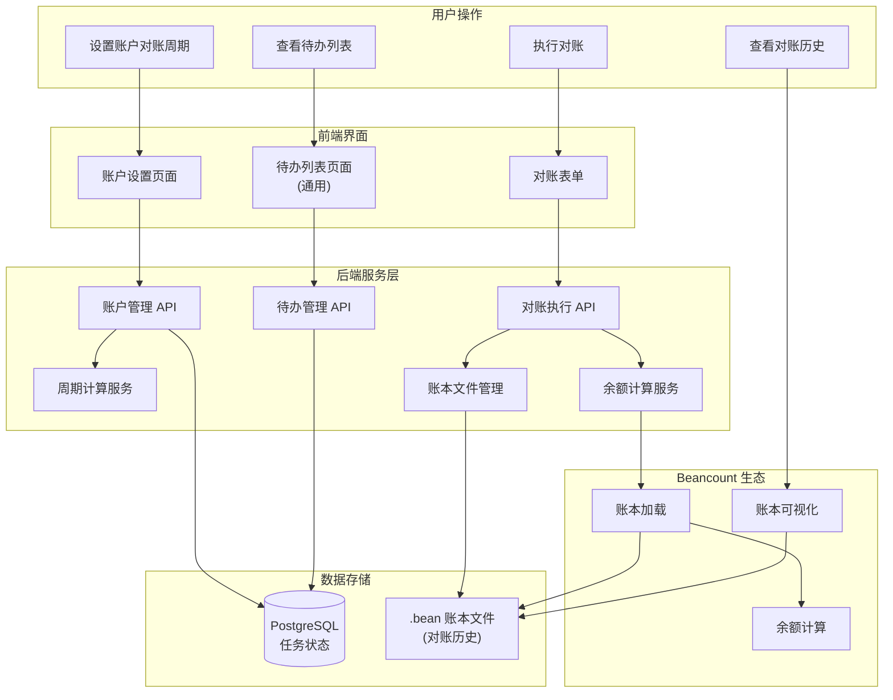
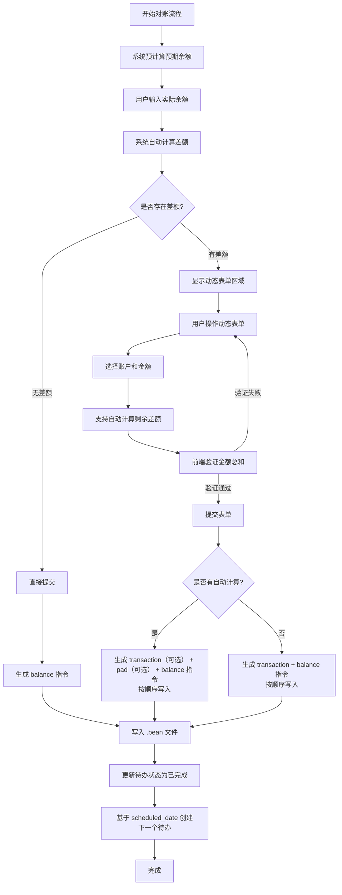

# 资产管理（对账功能）

## 1. 需求概述

### 1.1 背景描述

基于复式记账的核心在于资产负债表的准确性。当前平台缺乏管理现有资金的能力，用户无法方便地记录和校验每个账户的实际资产情况，导致账本数据与真实资产可能存在偏差。

很多用户不理解 Beancount 中 Balance/Pad 指令的作用，缺乏便捷的对账工具来定期核对账户余额。

### 1.2 目标用户

- 使用 Beancount 进行个人记账的用户
- 需要定期核对多个资产账户（银行卡、支付宝、微信等）余额的用户
- 希望保持账本数据与真实资产一致的用户

### 1.3 预期价值

- 用户可随时了解真实的资产情况
- 自动化对账提醒，减少遗忘风险
- 智能差额调整，简化手动平账流程
- 提升账本数据的可信度和完整性

---

## 2. 功能需求

### 2.1 功能描述

1. **通用待办模型**：新建 `ScheduledTask` 待办模型，支持多种任务类型（对账、AI 反馈确认等），解耦账户与对账逻辑
2. **对账周期设置**：用户可以为账户设置对账周期，采用「单位 + 数量」的方式（如每 1 月、每 2 周、每 15 天），灵活支持各种周期需求
3. **首次创建待办**：账户首次设置对账周期时，系统自动创建 ScheduledTask 记录，执行日期为当天（立即可执行）
4. **待办列表展示**：待办列表查询 `scheduled_date <= 今天` 且 `status = pending` 的 ScheduledTask 记录
5. **待办管理**：用户可通过待办管理页面修改对账待办的执行日期（如推迟到下周）
6. **余额计算与对账执行**：用户执行对账时，系统实时计算当前余额作为参考（支持多币种），用户输入实际余额后生成 transaction/pad/balance 指令（按此顺序）
7. **对账完成后更新**：对账完成后，更新当前待办状态为 `completed` 并记录 `completed_date`，根据当前待办的 `scheduled_date`（而非完成日期）和账户的对账周期创建下一个待办记录，保持周期性（如每月 1 号对账，即使 5 号才完成，下次仍为下月 1 号）
8. **差额处理**（三种场景）：

- **无差额**：预期余额 = 实际余额，仅生成 `balance` 断言指令
- **有差额**：用户可手动添加零条或多条 `transaction` 记录，将差额分配到具体账户，剩余差额由 `pad` 兜底，生成 `transaction`（可选） + `pad`（可选） + `balance` 指令（按此顺序）

1. **多币种支持**：系统支持对账多种货币（如 CNY、COIN 等），用户在对账时需指定币种，系统计算该币种的预期余额，生成对应币种的指令

> **解耦设计说明**：
>
> 账户、待办、周期三方解耦：
>
> - **Account（账户）**：只存储周期配置（unit + interval），不负责待办的具体日期
> - **ScheduledTask（待办）**：存储 `scheduled_date`（预期执行日期，用户可调整）和 `completed_date`（实际完成日期），预期执行日期可以被用户独立修改
> - **CycleCalculator（周期计算）**：只负责根据账户设置的周期配置计算下一个日期，**基于当前待办的 `scheduled_date`（而非 `completed_date`）计算**，保持周期性（如每月 1 号对账，即使 5 号才完成，下次仍为下月 1 号）

### 2.2 用户故事

```text
作为 记账用户，
我希望 为账户设置对账周期，系统自动提醒我输入实际余额，
以便 保证账本数据与真实资产一致。
```

```text
作为 记账用户，
我希望 在对账时看到系统计算的预期余额，
以便 快速发现账本与实际资产的差异并进行调整。
```

```text
作为 记账用户，
我希望 能修改对账待办的执行日期，
以便 灵活安排对账时间，不受周期的严格限制。
```

### 2.3 功能边界

#### 包含范围

- [x] 通用待办模型：支持多种任务类型，解耦账户与对账逻辑
- [x] 周期单位枚举：天/周/月/年四种单位
- [x] 灵活周期配置：用户可设置「每 N 个单位」的周期（如每 1 月、每 2 周、每 15 天）
- [x] 日历计算服务：根据周期单位和间隔自动计算下一次执行日期，自动处理月末等边界情况
- [x] 账户对账周期设置：存储周期单位和间隔到账户模型
- [x] 首次设置周期时自动创建待办（执行日期为今日）
- [x] 待办列表页面：查询当日到期且状态为待执行的待办
- [x] 待办管理：支持修改待办的执行日期
- [x] 对账执行：实时计算余额（支持多币种）+ 用户输入实际余额（指定币种）+ 生成 transaction/pad/balance 指令（按此顺序）
- [x] 多币种对账：支持对账多种货币（如 CNY、COIN 等），用户需指定币种进行对账
- [x] 对账完成后：更新当前待办状态为 `completed` 并记录 `completed_date` + 根据当前待办的 `scheduled_date` 和账户周期创建下一个待办（保持周期性，如每月 1 号对账，即使 5 号才完成，下次仍为下月 1 号）
- [x] 周期配置变更处理：用户修改周期后，相关待办不会自动更新；用户删除周期后，相关待办的状态变更为 `cancelled`

#### 不包含范围

- [ ] 复杂周期规则（如每月第一个周一、每月最后一天等，后续可扩展）
- [ ] 批量对账（首期逐个账户对账）
- [ ] 日历 UI 视图（首期仅显示 " 下次执行日期 " 文本）
- [ ] 其他类型待办（AI 反馈确认等，后续扩展）

---

## 3. 涉及模块与职责

### 涉及模块

- [x] **Backend** - `Beancount-Trans-Backend/` - Django REST API
- [x] **Frontend** - `Beancount-Trans-Frontend/` - Vue 3 + TypeScript
- [ ] **Android** - `Beancount-Trans-Android/`（规划中）
- [x] **Docs** - `Beancount-Trans-Docs/` - Docusaurus 文档
- [ ] **Assets** - `Beancount-Trans-Assets/` - Beancount 账本模板

### 本需求职责划分

| 模块       | 本需求中的职责                                                                | 原因说明                                           |
| -------- | ---------------------------------------------------------------------- | ---------------------------------------------- |
| Backend  | 通用待办模型、周期单位枚举、日历计算服务、余额计算服务（支持多币种）、Beancount 集成、transaction/pad/balance 指令生成（按顺序） | 待办模型解耦、周期逻辑统一在后端、数据持久化、Beancount 库调用、文件写入需在服务端 |
| Frontend | 账户设置页面扩展（周期单位下拉 + 间隔数量输入）、待办列表页面（通用，首期仅展示对账任务）、对账表单（预览/确认）、显示下次执行日期    | UI 交互、表单输入、状态展示                                |
| Docs     | 账户资产管理用户文档                                                             | 帮助用户理解 Balance/Pad 概念和对账流程                     |

### 跨模块协作（如有）

| 场景     | 涉及模块               | 协作方式                                                                                                                                                                                                                   |
| ------ | ------------------ | ---------------------------------------------------------------------------------------------------------------------------------------------------------------------------------------------------------------------- |
| 设置对账周期 | Frontend + Backend | 前端选择周期单位（天/周/月/年）+ 输入间隔数量 → 后端保存周期配置到账户，首次设置时创建执行日期为今日的待办                                                                                                                                                              |
| 查看待办列表 | Frontend + Backend | 前端请求列表 → 后端查询当日到期且状态为待执行的待办                                                                                                                                                                                            |
| 修改待办日期 | Frontend + Backend | 前端修改待办执行日期 → 后端更新待办的预期执行日期（不影响账户的周期配置）                                                                                                                                                                                 |
| 执行对账   | Frontend + Backend | 前端对账表单时后端提供当前预期余额（支持多币种）供用户参考，前端选择币种并输入实际余额后自动计算差额：① 无差额：直接提交，后端生成 balance 指令；② 有差额：用户可手动添加 transaction 记录分配差额，剩余由 pad 账户兜底，后端生成 transaction（可选） + pad（可选） + balance 指令（按此顺序）。→ 后端写入 .bean 文件，更新当前待办状态为已完成并记录完成日期，基于当前待办的预期执行日期创建下一个周期的待办 |

---

## 4. 架构概览

### 4.1 系统组件



> **设计说明**：
>
> - PostgreSQL 仅存储任务调度状态（账户周期设置、待办任务）
> - .bean 文件是对账数据的唯一存储（balance/pad 指令），遵循 Beancount 单一数据源原则
> - Fava 作为对账历史的查看工具，无需在系统中重复实现

### 4.2 对账执行流程



### 4.3 关键设计原则

1. **解耦设计**：账户、待办、周期计算三方解耦
   - 账户只存储周期配置（单位 + 间隔），不负责待办的具体日期
   - 待办存储预期执行日期和实际完成日期，预期执行日期可独立修改
   - 周期计算基于当前待办的 `scheduled_date`（而非 `completed_date`）计算下一个日期，保持周期性

2. **数据存储原则**：
   - 对账历史存储在 .bean 文件中，遵循 Beancount 单一数据源原则
   - PostgreSQL 仅存储任务调度状态，不存储对账历史数据

3. **周期计算原则**：
   - 基于 `scheduled_date` 而非 `completed_date` 计算下一个待办日期
   - 如每月 1 号对账，即使 5 号才完成，下次仍为下月 1 号

### 4.4 技术选型

- **周期计算**：使用日期库处理月末等边界情况（如 1 月 31 日 + 1 月 = 2 月 28/29 日）
- **余额计算**：使用 Beancount 核心库加载账本并计算账户余额，支持多币种
- **差额处理**：支持三种场景（无差额、有差额），自动生成相应的 Beancount 指令，指令生成顺序为 transaction → pad → balance
- **多币种支持**：支持对账多种货币（如 CNY、COIN 等），用户需指定币种进行对账

### 4.5 数据流

```text
1. 首次设置对账周期
   用户 → 前端（账户设置，选择周期单位 + 输入间隔数量）
       → 后端（账户管理 API）
       → 数据库（更新账户周期配置）
       → 数据库（创建待办记录，执行日期为今日）
       ↑ 首次设置时，预期执行日期为今日（立即可执行）

2. 查看待办列表
   用户 → 前端（待办列表页面）
       → 后端（待办管理 API，查询当日到期且状态为 pending 的待办）
       → 返回待办列表（首期仅包含对账任务）

3. 修改待办预期执行日期
   用户 → 前端（待办管理，修改预期执行日期）
       → 后端（待办管理 API）
       → 数据库（更新待办的 scheduled_date）
       ↑ 不影响账户的周期配置

4. 执行对账
   用户 → 前端（点击待办进入对账表单）
       → 后端（对账 API，计算并返回预期余额，支持多币种）
       → 用户 → 前端（选择币种，输入实际余额，根据差额情况选择处理方式）
       → 差额处理：
          ① 无差额：直接提交，后端生成 balance 指令
          ② 有差额：用户可以手动添加 transaction 记录分配差额，也可以直接由 pad 账户兜底，还可以互相配合使用，后端生成 transaction（可选） + pad（可选） + balance 指令（按此顺序写入）
       → 后端（对账执行 API）
       → 写入 .bean 文件（对账历史，可通过 Fava 查看）
       → 数据库（更新当前待办状态为 completed，记录 completed_date）
       → 数据库（基于当前待办的 scheduled_date 创建下一个周期的待办）

5. 修改周期配置
   用户 → 前端（账户设置，修改周期单位或间隔）
       → 后端（账户管理 API）
       → 数据库（更新账户周期配置）
       ↑ 相关待办不会自动更新（保持原有 scheduled_date）

6. 删除周期配置
   用户 → 前端（账户设置，删除周期配置）
       → 后端（账户管理 API，清空周期配置）
       → 数据库（清空账户周期配置）
       → 数据库（将相关待办的状态更新为 cancelled）
```

---

## 5. 验收标准

### 5.1 功能验收

- [x] 通用待办模型：支持多种任务类型（首期仅实现对账） [completion:: 2026-01-22]
- [x] 周期单位枚举：提供四种周期单位（天/周/月/年） [completion:: 2026-01-22]
- [ ] 日历计算服务：能根据周期单位和间隔正确计算下一次执行日期，自动处理月末等边界情况
- [x] 用户可以为账户设置对账周期（选择单位 + 输入间隔数量，如「每 2 周」「每 1 月」「每 15 天」） [completion:: 2026-01-22]
- [x] 首次设置对账周期时自动创建 ScheduledTask 待办记录，执行日期为今日 [completion:: 2026-01-22]
- [x] 待办列表正确显示 `scheduled_date <= today()` 且 `status = pending` 的待办（UI 暂不区分今日/逾期） [completion:: 2026-01-22]
- [x] 用户可以通过待办管理修改对账待办的执行日期 [completion:: 2026-01-22]
- [x] " 开始对账 " 能正确计算并返回预期余额（支持多币种） [completion:: 2026-01-22]
- [x] " 执行对账 " 能正确处理两种差额场景： [completion:: 2026-01-22]
  - 无差额：仅生成 `balance` 指令
  - 有差额：生成用户添加的 `transaction`（可选） + `pad`（可选） + `balance` 指令（按此顺序）
- [x] 多币种对账：用户可以选择币种进行对账，系统正确计算该币种的预期余额并生成对应币种的指令 [completion:: 2026-01-22]
- [x] " 执行对账 " 完成后更新当前待办状态为 `completed` 并记录 `completed_date` + 从 Account 读取周期配置，基于当前待办的 `scheduled_date` 创建下一个待办（保持周期性） [completion:: 2026-01-23]
- [x] 用户修改周期配置后，相关待办不会自动更新 [completion:: 2026-01-23]
- [x] 用户删除周期配置后，相关待办的状态变更为 `cancelled` [completion:: 2026-01-23]
- [x] 对账历史（transaction/pad/balance 指令）正确写入 .bean 文件，指令顺序为 transaction → pad → balance，可通过 Fava 查看 [completion:: 2026-01-23]

---

## 6. 任务分解

Cursor AI 生成计划时参考此分解

任务编号规则：`[模块]-[序号]`

| 前缀 | 模块 |
| ------ | ------ |
| BE | Backend |
| FE | Frontend |
| DOC | Docs |
| INT | Integration |

### 本需求任务清单

- [ ] **周期配置 UI 示意**: 创建通用待办模型 `ScheduledTask`（task_type, content_type, object_id, scheduled_date, completed_date, status）
- [ ] **新增/修改文档**: 创建用户对账配置模型 `ReconciliationSettings`（default_adjustment_account）
- [ ] **BE-1**: 定义周期单位枚举 `CycleUnit`（TextChoices：days, weeks, months, years）
- [ ] **BE-1.1**: 实现 `CycleCalculator` 日历计算服务（使用 `python-dateutil` 的 `relativedelta`）
- [ ] **BE-2**: 扩展 Account 模型添加 `reconciliation_cycle_unit` 和 `reconciliation_cycle_interval` 字段
- [ ] **BE-3**: 实现 BalanceCalculationService（使用 beancount.loader + realization）
- [ ] **BE-4**: 实现 ScheduledTask API（列表、详情、修改日期、取消待办）
- [ ] **BE-5**: 实现 reconcile/start、reconcile/execute action 端点（含差额处理三种场景，基于 scheduled_date 创建下一个待办）
- [ ] **BE-6**: 实现 Account API 扩展（修改/删除周期配置时处理相关待办）
- [ ] **BE-7**: 编写单元测试
- [ ] **BE-9**: 创建 TypeScript 类型定义（ScheduledTask、CycleUnit 枚举）
- [ ] **BE-10**: 实现待办和对账相关 API 调用函数
- [ ] **FE-1**: 开发待办列表页面（通用，首期仅展示对账任务，暂不区分今日/逾期）
- [ ] **FE-2**: 开发对账表单组件（含差额处理三种场景的 UI，使用用户配置的默认调整账户）
- [ ] **FE-3**: 账户设置页面集成对账周期配置（单位下拉 + 间隔数量输入）
- [ ] **FE-4**: 添加路由配置
- [ ] **FE-5**: 编写账户对账功能使用文档
- [ ] **FE-7**: 编写 Balance/Pad 概念说明文档
- [ ] **DOC-1**: 前后端联调测试
- [ ] **DOC-2**: 端到端测试（完整对账流程）

---

## 7. 风险与依赖

### 7.1 技术风险

### 7.2 外部依赖

- `beancount` Python 库（已在项目依赖中）
- `python-dateutil` Python 库（用于日历计算服务，需添加到依赖）
- PostgreSQL 数据库
- 用户的 .bean 账本文件存在且格式正确

---

## 8. 参考资料

- [Beancount Balance 指令文档](https://beancount.github.io/docs/beancount_language_syntax.html#balance-assertions)
- [Beancount Pad 指令文档](https://beancount.github.io/docs/beancount_language_syntax.html#pad)
- [python-dateutil relativedelta 文档](https://dateutil.readthedocs.io/en/stable/relativedelta.html)
- 项目现有的 `BeanFileManager` 实现：`project/utils/file.py`

### 8.1 指令生成示例

多币种对账（COIN 货币）生成的指令示例：

```text
2025-12-31 * "Beancount-Trans" "手动对账"
    Income:Transfer:Governmental -1000.00 COIN
    Assets:Savings:Government:Provident:WenZhou 1000.00 COIN
    
2025-12-31 * "Beancount-Trans" "手动对账"
    Expenses:Home:Decoration  10000.00 COIN
    Assets:Savings:Government:Provident:WenZhou -10000.00 COIN

2025-12-31 pad          Assets:Savings:Government:Provident:WenZhou Income:Investment:Interest
2026-01-01 balance      Assets:Savings:Government:Provident:WenZhou                                                                   11968.28 COIN  ; 温州公积金
```

指令生成顺序：transaction → pad → balance
