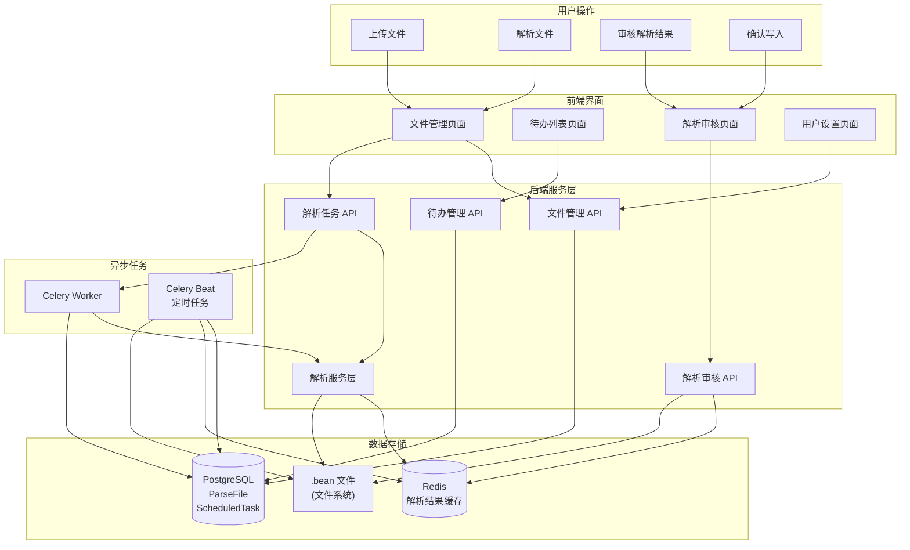
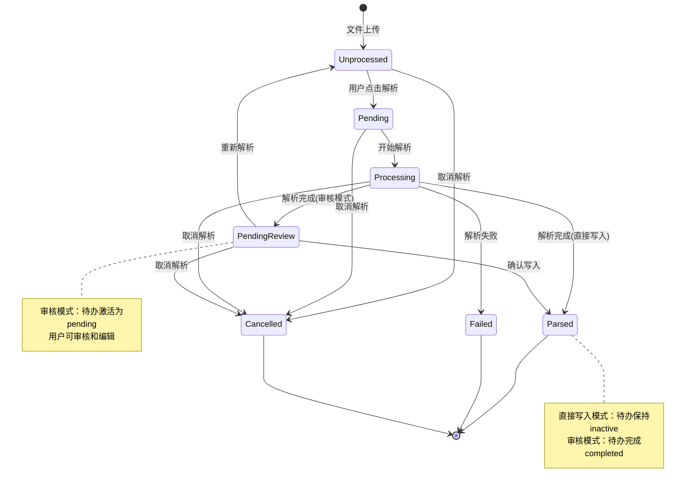

# 解析审核

%%
该文档属于需求和架构功能设计也就是 What，需要根据该文档输出技术文档 How
输出的技术文档（How）需要包含细节，最后要重新根据细节验证需求完成闭环
%%

## 1. 需求概述

### 1.1 背景描述

当前多文件批量解析功能在解析完成后直接写入账本，用户无法在写入前审核和修正 AI 分类不准确的记录。当 AI 分类错误时（如将 "十月结晶" 误分类为 "等多件"），用户需要手动编辑 .bean 文件修正，操作成本高。

单文件解析（`SingleBillAnalyzeView`）已支持用户反馈重解析，可以在写入前选择合适的关键字。多文件解析（`MultiBillAnalyzeView`）缺少此环节，但考虑到实际使用场景（通常1-2个文件），用户同样需要精细调整的能力。

此外，某些特殊场景（如无映射关键字覆盖、需要微调 Beancount 语法等）需要直接编辑格式化后的 Beancount 条目，而不仅仅是选择关键字。

### 1.2 目标用户

- **严谨型用户**：需要审核环节确保数据准确性，愿意花费时间逐条检查
- **粗放型用户**：对 AI 分类有较高信任度或自身分类粒度较粗，希望直接写入以提高效率

### 1.3 预期价值

- **数据准确性**：通过审核环节，用户可以在写入前修正错误的分类，避免错误数据进入账本
- **功能对齐与增强**：多文件解析与单文件解析在关键字选择能力上对齐，并支持直接编辑格式化结果，满足无映射关键字覆盖等特殊场景
- **用户体验**：通过提供选择权（审核模式/直接写入模式），满足不同用户的使用习惯和需求
- **平台属性**：通过待办系统管理解析任务，支持异步处理和状态追踪，体现平台属性

---

## 2. 功能需求

### 2.1 功能描述

将多文件批量解析从 "解析后直接写入" 模式转变为 "解析后审核再写入" 模式，核心功能包括：

1. **解析模式偏好设置**：在用户配置中支持设置默认解析模式（审核模式/直接写入模式），默认为审核模式
2. **解析待办任务生成**：多文件解析完成后，为每个文件的解析结果生成解析待办任务（不立即写入），任务关联到对应的文件
3. **解析结果审核**：用户可以在审核页面逐条查看解析结果，对 AI 分类不准确的记录选择正确的关键字，或直接编辑格式化后的 Beancount 条目，两种方式可以互相覆盖，实时预览格式化后的 Beancount 条目
4. **待办任务管理**：在待办列表中展示解析待办任务，支持状态追踪、到期自动确认写入（24小时缓存过期）
5. **关键字选择能力**：复用单文件解析的重解析机制，支持查看 AI 推荐关键字和候选关键字列表，选择最合适的分类（选择关键字会覆盖编辑内容）

### 2.2 用户故事

```text
作为 记账用户，
我希望 在批量解析完成后，能够依次审核各文件的解析结果，对每条记录选择合适的关键字进行分类，或直接编辑格式化后的 Beancount 条目，确认无误后再写入账本，
以便 确保账本数据的准确性，避免错误分类导致的账务混乱，满足无映射关键字覆盖等特殊场景需求，减少后续修正成本。
```

### 2.3 功能边界

#### 包含范围

- [x] 解析模式偏好设置（审核模式/直接写入模式）
- [x] 多文件解析后生成解析待办任务（每个文件对应一个待办）
- [x] 解析待办审核页面（逐条查看、关键字选择、条目直接编辑、实时预览）
- [x] 解析待办列表展示（在现有待办列表基础上扩展）
- [x] 解析待办状态管理（待审核、已确认、已过期）
- [x] 解析结果缓存机制（24小时过期，到期自动确认写入）
- [x] 关键字选择与重解析（复用 `ReparseEntryView` 机制）
- [x] 条目直接编辑功能（单击预览框进入编辑模式，失去焦点时自动保存）
- [x] 确认写入、重新解析覆盖待办

#### 不包含范围

- 取消解析功能（已在文件管理中实现）
- 批量审核多个解析待办（本次仅支持单个文件逐条审核）
- 解析待办的批量操作（删除、批量确认等）
- 解析待办的历史记录查询（仅展示待审核的解析待办，不包含已完成、已取消的待办，不包含追溯和审计功能）

---

## 3. 涉及模块与职责

%% 勾选本需求涉及的模块，并在下方填写**本需求特定**的职责划分 %%

### 3.1 涉及模块

- [x] **Backend** - `Beancount-Trans-Backend/` - Django REST API
- [x] **Frontend** - `Beancount-Trans-Frontend/` - Vue 3 + TypeScript
- [ ] **Android** - `Beancount-Trans-Android/`（规划中）
- [ ] **Docs** - `Beancount-Trans-Docs/` - Docusaurus 文档
- [ ] **Assets** - `Beancount-Trans-Assets/` - Beancount 账本模板

### 3.2 本需求职责划分

| 模块       | 本需求中的职责                                                                                                                                                                                                                                                                                                                                                                                                                                                           | 原因说明                                              |
| -------- | ----------------------------------------------------------------------------------------------------------------------------------------------------------------------------------------------------------------------------------------------------------------------------------------------------------------------------------------------------------------------------------------------------------------------------------------------------------------- | ------------------------------------------------- |
| Backend  | 1. 扩展 `FormatConfig` 模型，添加 `parsing_mode_preference` 字段（审核模式/直接写入模式）<br>2. 修改 `parse_single_file_task`，根据用户偏好决定是否立即写入或生成解析待办<br>3. 扩展 `ScheduledTask` 模型，支持 `parse_review` 任务类型，关联到 `ParseFile`<br>4. 创建解析待办审核 API（获取解析结果、更新关键字、更新编辑内容、确认写入、重新解析）<br>5. 实现解析结果缓存机制（24小时过期，存储在 Redis），支持存储编辑后的条目内容，初始状态时 `edited_formatted` 默认为 `formatted`<br>6. 实现解析待办到期自动确认写入的定时任务（Celery Beat）<br>7. 复用 `ReparseEntryView` 的关键字选择与重解析逻辑<br>8. 实现 Beancount 语法校验（写入前校验编辑后的条目语法） | 数据持久化、业务逻辑执行、缓存管理、异步任务处理、语法校验必须在服务端进行，保证数据一致性和安全性 |
| Frontend | 1. 在用户设置页面添加解析模式偏好选择组件<br>2. 创建解析待办审核页面（逐条展示解析结果、关键字选择、条目编辑、实时预览）<br>3. 扩展待办列表组件，支持解析待办卡片展示<br>4. 实现解析待办的交互操作（确认写入、重新解析）<br>5. 实现解析结果实时预览（单条记录格式化展示，单击进入编辑模式）<br>6. 实现条目编辑功能（预览框失去焦点时自动保存编辑内容到后端）<br>7. 添加解析待办横幅提醒（参考对账任务，自动更新）                                                                                                                                                                                                                                   | UI 渲染、用户交互、状态管理、数据可视化、文本编辑由前端处理，提升用户体验和响应速度       |

### 3.3 跨模块协作

| 场景 | 涉及模块 | 协作方式 |
|------|----------|----------|
| 多文件解析触发 | Frontend + Backend | 前端：用户在文件管理中选择多个文件，点击"解析"按钮 → 后端：接收文件ID列表，根据用户偏好决定是否生成解析待办或直接写入 |
| 解析待办审核 | Frontend + Backend | 前端：用户进入审核页面，展示解析结果列表 → 后端：从缓存获取解析结果，返回格式化数据（edited_formatted 默认为 formatted） → 前端：用户选择关键字或直接编辑条目（可互相覆盖） → 后端：调用重解析接口更新结果（更新 edited_formatted 为新的 formatted）或更新编辑内容（更新 edited_formatted 为用户编辑内容） → 前端：实时预览更新后的条目 |
| 条目直接编辑 | Frontend + Backend | 前端：用户单击预览框进入编辑模式 → 用户编辑 Beancount 条目内容 → 预览框失去焦点时 → 前端调用更新编辑内容 API → 后端接收编辑后的条目内容，更新缓存 → 前端实时预览编辑后的条目 |
| 确认写入 | Frontend + Backend | 前端：用户点击"确认写入"按钮 → 后端：从缓存获取最终解析结果（包括编辑后的条目），进行 Beancount 语法校验 → 校验通过后写入 .bean 文件，更新解析待办状态为已完成 → 校验失败则返回错误信息 |
| 重新解析覆盖 | Frontend + Backend | 前端：用户点击"重新解析"按钮 → 后端：重新执行解析任务，更新缓存和解析待办状态 |
| 待办列表展示 | Frontend + Backend | 前端：请求待办列表，筛选 `task_type='parse_review'` 且 `status='pending'` → 后端：返回解析待办任务列表（包含文件信息、创建时间、过期时间） |
| 到期自动确认 | Backend (Celery Beat) | 定时任务：扫描过期的解析待办（创建时间超过24小时），自动确认写入，更新状态为已完成 |

---

## 4. 架构概览

### 4.1 系统组件

**核心组件：**

1. **解析服务层** (`AnalyzeService`)
   - 负责账单解析的核心逻辑
   - 支持单文件和多文件解析
   - 集成解析管道（ConvertToCSVStep → ParseStep → FormatStep → FileWritingStep）

2. **待办任务系统** (`ScheduledTask`)
   - 通用待办模型，支持多种任务类型（对账、解析审核等）
   - 使用 GenericForeignKey 关联到不同业务对象（Account、ParseFile）
   - 支持任务状态管理（inactive、pending、completed、cancelled）
   - 解析审核待办采用"始终创建"策略：文件上传时即创建待办（状态为 inactive），解析完成后根据用户偏好决定是否激活（inactive → pending）
   - 文件与待办一对一绑定，状态强关联，保证数据一致性
   - **解析待办特定说明**：
     - 解析待办不需要 `scheduled_date` 字段，因为解析审核待办是事件触发的，与文件强关联
     - 一旦处于 `pending` 状态则直接列出，这是需要执行的
     - 解析失败时，待办处于 `inactive` 状态，不在待办列表展示

3. **解析结果缓存** (Redis)
   - 存储解析后的格式化数据（24小时过期）
   - Key 格式：`parse_result:{file_id}`（统一使用 file_id，因为文件与待办一对一绑定）
   - 包含原始数据、解析结果、候选关键字等信息
   - 缓存到期后自动确认写入，不应出现其他处理场景

4. **解析待办审核 API**
   - 获取解析结果：从缓存读取，返回格式化数据（edited_formatted 初始状态默认为 formatted）
   - 更新关键字：调用重解析接口，更新缓存（更新 formatted 和 edited_formatted）
   - 更新编辑内容：接收用户编辑后的条目内容，更新缓存（更新 edited_formatted）
   - 确认写入：从缓存读取最终结果（使用 edited_formatted，始终有值），进行语法校验后写入 .bean 文件

5. **定时任务** (Celery Beat)
   - 扫描过期的解析待办（创建时间超过24小时）
   - 自动确认写入，更新状态为已完成

**系统架构图：**



### 4.2 执行流程

**文件上传流程（始终创建待办）：**

```
1. 用户上传文件
2. 后端创建 ParseFile（状态：unprocessed）
3. 后端始终创建解析待办任务（ScheduledTask，状态：inactive）
   - 无论用户偏好是什么，都创建待办记录
   - 待办与文件一对一绑定，保证数据一致性
4. 前端不展示 inactive 状态的待办（通过状态过滤）
```

**多文件解析流程（审核模式）：**

```
1. 用户选择多个文件 → 点击"解析"
2. 前端调用 MultiBillAnalyzeView → 检查用户解析模式偏好
3. 如果偏好为"审核模式"：
   a. 创建 Celery 任务组，执行解析（不写入文件，args['write'] = False）
   b. 解析完成后：
      - ParseFile 状态更新为 pending_review（待审核）
      - 解析待办状态从 inactive 激活为 pending（前端可展示）
      - 解析结果存入 Redis 缓存（24小时过期），初始状态时 `edited_formatted` 默认为 `formatted`（确保始终有值）
   c. 返回任务组ID和解析待办ID列表
4. 前端收到待办提醒 → 进入审核页面
5. 用户逐条查看解析结果 → 选择关键字 → 实时预览
6. 用户确认写入 → 后端从缓存读取结果 → 写入 .bean 文件
7. ParseFile 状态更新为 parsed，解析待办状态更新为 completed
```

**多文件解析流程（直接写入模式）：**

```
1. 用户选择多个文件 → 点击"解析"
2. 前端调用 MultiBillAnalyzeView → 检查用户解析模式偏好
3. 如果偏好为"直接写入模式"：
   a. 创建 Celery 任务组，执行解析（立即写入文件，args['write'] = True）
   b. 解析完成后：
      - ParseFile 状态更新为 parsed（直接完成）
      - 解析待办状态保持为 inactive（不激活，前端不展示）
      - 不存储解析结果到 Redis（因为已直接写入）
```

**用户切换偏好场景：**

```
场景1：从直接写入模式切换到审核模式
- 已上传的文件：ParseFile 状态为 unprocessed/parsed，待办状态为 inactive
- 用户切换偏好后，点击"解析"（如果文件未解析）
- 解析完成后，待办从 inactive 激活为 pending（无缝切换）

场景2：从审核模式切换到直接写入模式
- 已上传的文件：ParseFile 状态为 unprocessed/pending_review，待办状态为 inactive/pending
- 用户切换偏好后，点击"解析"（如果文件未解析）
- 解析完成后，ParseFile 直接变为 parsed，待办保持或回退为 inactive
- pending_review 状态的文件保持现状，用户可手动处理
```

**解析待办审核流程：**

```
1. 用户进入解析待办审核页面
2. 前端请求解析结果 API → 后端从缓存获取解析结果
3. 前端展示解析结果列表（逐条展示）
4. 用户可以选择以下两种方式调整：
   a. 选择关键字 → 前端调用重解析 API → 后端更新缓存（覆盖编辑栏内容，设置 edited_formatted 为 格式化数据中的formatted内容）
   b. 直接编辑条目 → 用户单击预览框进入编辑模式 → 用户编辑内容 → 预览框失去焦点时自动保存 → 前端调用更新编辑内容 API → 后端更新缓存（设置 edited_formatted 为 用户编辑后的内容）
5. 前端实时预览更新后的 Beancount 条目（预览框内容）
6. 用户确认写入 → 前端调用确认写入 API → 后端从缓存读取编辑栏内容（edited_formatted）→ 进行语法校验 → 校验通过后写入文件 → 更新待办状态
```

**数据同步说明：**

```
- 一旦处于审核中（pending_review），数据已经从文件转移到待办（存储在 Redis 缓存）
- 除非删除文件（待办与文件相关联，会同步删除待办），否则审核过程中的数据是独立的
- 用户可以在预览功能中编辑最终要写入的条目，实现部分确认写入的场景
```

**到期自动确认流程：**

```
1. Celery Beat 定时任务（每小时执行一次）
2. 扫描所有 status='pending' 且 task_type='parse_review' 的待办
3. 检查创建时间，如果超过24小时：
   a. 从缓存获取解析结果（使用 edited_formatted，始终有值）
   b. 写入 .bean 文件
   c. 更新待办状态为 completed
```

**重新解析流程：**

```
1. 用户在审核页面点击"重新解析"按钮
2. 相当于在文件管理中再次进行解析操作
3. 待办状态不发生改变（保持 pending），只有剩余确认时间更新（重新计算24小时）
4. 解析完成后，新数据覆盖现有待办数据（更新 Redis 缓存）：
   - formatted: 更新为新的解析结果
   - edited_formatted: 重置为新的 formatted（与初始状态一致，确保始终有值）
5. 用户才能进行审核选择编辑操作
```

### 4.3 关键设计原则

1. **解耦设计**：
   - 解析待办复用现有的 `ScheduledTask` 模型，通过 `task_type` 区分业务类型
   - 使用 GenericForeignKey 关联到 `ParseFile`，保持模型解耦
   - 解析结果缓存独立于待办任务，支持缓存过期后的降级处理

2. **数据存储原则**：
   - 解析结果存储在 Redis 缓存（24小时过期），不持久化到数据库
   - 待办任务存储在 PostgreSQL，记录任务元数据和状态
   - 最终写入的 .bean 文件存储在文件系统（通过 BeanFileManager）

3. **功能复用原则**：
   - 关键字选择与重解析复用 `ReparseEntryView` 的逻辑
   - 解析管道复用现有的 `BillParsingPipeline` 和各个 Step
   - 待办列表复用现有的待办系统 UI 组件
   - Beancount 语法校验复用现有的校验逻辑（如使用 beancount 库进行校验）

4. **用户体验原则**：
   - 审核模式为默认模式，确保数据准确性
   - 支持用户偏好设置，满足不同用户需求
   - 实时预览更新后的条目，提供即时反馈
   - 到期自动确认，避免用户遗忘导致数据丢失

5. **向后兼容原则**：
   - 保持 `MultiBillAnalyzeView` 接口兼容，通过用户偏好控制行为
   - 不破坏现有的单文件解析功能
   - 不破坏现有的对账待办功能

6. **状态机强关联原则**：
   - 文件与待办一对一绑定：每个文件上传时即创建对应的解析待办（状态为 inactive）
   - 状态同步：ParseFile 状态与 ScheduledTask 状态保持强关联，取消解析时同步更新
   - 状态驱动：通过状态控制行为，而不是通过存在性判断，简化逻辑
   - 无缝切换：用户切换偏好时，已存在的待办可以立即激活，无需额外处理

7. **始终创建待办策略**：
   - 文件上传时统一创建待办（无论用户偏好），初始状态为 inactive
   - 解析完成后根据用户偏好决定是否激活待办（inactive → pending）
   - 前端只展示需要处理的待办（status='pending'），隐藏未激活的待办（status='inactive'）
   - 优势：保证数据一致性、支持无缝切换、简化逻辑、避免条件分支

### 4.4 技术选型

- **后端框架**：Django REST Framework
- **异步任务**：Celery + Redis
- **缓存存储**：Redis（解析结果缓存，24小时过期）
- **数据库**：PostgreSQL（待办任务、文件元数据）
- **前端框架**：Vue 3 + TypeScript
- **状态管理**：Pinia（可选，用于待办列表状态）
- **UI 组件**：Element Plus

### 4.5 数据流

**解析结果数据结构（Redis 缓存）：**

```json
{
  "file_id": 123,
  "formatted_data": [
    {
      "uuid": "2024022522001174561439593142",
      "formatted": "2024-02-25 * \"十月结晶\" ...",  // 原始解析结果或重解析后的结果
      "edited_formatted": "2024-02-25 * \"十月结晶\" ...",  // 编辑栏内容：初始状态默认为 formatted，选择关键字后更新为新的 formatted，直接编辑后更新为用户编辑内容（始终有值）
      "selected_expense_key": "十月结晶",
      "expense_candidates_with_score": [
        {"key": "等多件", "score": 0.5432},
        {"key": "十月结晶", "score": 0.5606}
      ],
      "original_row": {...}
    }
  ],
  "created_at": "2026-01-30T10:00:00Z",
  "expires_at": "2026-01-31T10:00:00Z"
}
```

**解析待办任务数据结构（PostgreSQL）：**

```python
ScheduledTask {
  task_type = 'parse_review'
  content_type = ContentType(ParseFile)
  object_id = 123  # ParseFile.id（文件上传时即创建）
  created_at = 2026-01-30 10:00:00  # 创建时间
  status = 'inactive' | 'pending' | 'completed' | 'cancelled'
  # inactive: 待办已创建但未激活（文件未解析、直接写入模式、取消解析、解析失败）
  # pending: 待办已激活，等待用户审核（审核模式，待审核），一旦处于此状态则直接列出，这是需要执行的
  # completed: 用户已确认写入或到期自动确认写入
  # 注意：解析待办不需要 scheduled_date 字段，因为解析审核待办是事件触发的，与文件强关联
}
```

**文件状态与待办状态映射关系：**

| ParseFile 状态 | ScheduledTask 状态 | 说明 |
|---------------|-------------------|------|
| `unprocessed` | `inactive` | 文件未解析，待办未激活 |
| `pending` | `inactive` | 文件待解析，待办未激活 |
| `processing` | `inactive` | 文件解析中，待办未激活 |
| `pending_review` | `pending` | 文件待审核，待办已激活（审核模式） |
| `parsed` | `completed` | 文件已解析，待办已完成（审核模式） |
| `parsed` | `inactive` | 文件已解析，待办未激活（直接写入模式） |
| `failed` | `inactive` | 文件解析失败，待办保持未激活（不在待办列表展示） |
| `cancelled` | `inactive` | 文件取消解析，待办也取消改为未激活 |

**API 数据流：**

```
前端 → GET /api/parse-review/{task_id}/results
后端 → 从 Redis 获取 parse_result:{file_id}
后端 → 返回格式化数据（包括 edited_formatted 字段）

前端 → POST /api/parse-review/{task_id}/reparse
后端 → 调用 ReparseEntryView 逻辑
后端 → 更新 Redis 缓存（设置 edited_formatted 为 格式化数据中的formatted内容）
后端 → 返回更新后的结果

前端 → PUT /api/parse-review/{task_id}/entries/{uuid}/edit
后端 → 接收编辑后的条目内容
后端 → 更新 Redis 缓存中的 edited_formatted 字段
后端 → 返回更新后的结果

前端 → POST /api/parse-review/{task_id}/confirm
后端 → 从 Redis 获取最终结果（使用编辑栏内容：edited_formatted，始终有值）
后端 → 进行 Beancount 语法校验
后端 → 校验通过：调用 BeanFileManager 写入文件，更新 ScheduledTask 状态为 completed
后端 → 校验失败：返回错误信息，不写入文件
```

### 4.6 状态机设计

**核心设计理念：**

1. **一对一绑定**：每个文件（ParseFile）对应一个解析待办（ScheduledTask），文件上传时即创建待办记录
2. **状态驱动**：通过状态控制行为，而不是通过存在性判断，简化逻辑
3. **强关联同步**：ParseFile 状态与 ScheduledTask 状态保持强关联，状态变更时同步更新

**状态流转规则：**

**审核模式（review）下的完整流程：**

- 文件上传：ParseFile `unprocessed` → ScheduledTask `inactive`（创建）
- 开始解析：ParseFile `pending` → `processing`，ScheduledTask `inactive`（保持不变）
- 解析完成：ParseFile `pending_review`，ScheduledTask `inactive` → `pending`（激活，一旦处于此状态则直接列出）
- 确认写入或到期自动写入：ParseFile `pending_review` → `parsed`，ScheduledTask `pending` → `completed`
- 取消解析：ParseFile `cancelled`，ScheduledTask `inactive/pending` → `inactive`（同步）
- 解析失败：ParseFile `failed`，ScheduledTask `inactive`（保持未激活，不在待办列表展示）
- 重新解析：ParseFile `pending_review` → `unprocessed` → `pending` → `processing` → `pending_review`，ScheduledTask `pending`（状态不变，只有剩余确认时间更新）

**直接写入模式（direct_write）下的完整流程：**

- 文件上传：ParseFile `unprocessed` → ScheduledTask `inactive`（创建）
- 开始解析：ParseFile `pending` → `processing`，ScheduledTask `inactive`（保持不变）
- 解析完成：ParseFile `parsed`（直接完成），ScheduledTask `inactive`（保持未激活）
- 取消解析：ParseFile `cancelled`，ScheduledTask `inactive` → `inactive`（同步）

**用户切换偏好的影响：**

- **从直接写入切换到审核模式**：已上传的文件待办为 `inactive`，解析完成后自动激活为 `pending`（无缝切换）
- **从审核模式切换到直接写入**：已解析的文件（`pending_review`）保持状态，未解析的文件解析后直接完成，待办保持 `inactive`

**前端展示逻辑：**

- 待办列表仅展示需要执行的待办，不同待办类型有不同的字段需求：
  - **对账待办**：展示逾期或今日预期执行的（基于 `scheduled_date` 字段）
  - **解析审核待办**：一旦对文件进行解析，解析完成后就将数据给到缓存后状态改为 `pending`，需要执行（基于 `status='pending'` 和 `task_type='parse_review'`）
- `inactive` 状态的待办不展示（通过后端过滤），包括：
  - 文件未解析的待办
  - 直接写入模式的待办（解析完成后不激活）
  - 解析失败的待办（`failed` 状态，待办保持 `inactive`）
  - 取消解析的待办

**状态机流程图：**



### 4.7 前端页面布局

**解析待办审核表单页面（ParseReviewForm.vue）布局：**

```
┌─────────────────────────────────────────────────────────────┐
│  解析待办审核 - xxx.pdf                    [重新解析]  [返回]   │
├─────────────────────────────────────────────────────────────┤
│                                                              │
│  ┌──────────────────────────┬──────────────────────────┐  │
│  │ Beancount 条目预览        │ 关键字选择                │  │
│  │ (可编辑)                  │                          │  │
│  ├──────────────────────────┼──────────────────────────┤  │
│  │ ┌──────────────────────┐ │ 当前分类：                │  │
│  │ │ 2024-02-25 * "十月结晶"│ │ [十月结晶]                │  │
│  │ │   Expenses:Daily:... │ │                          │  │
│  │ │   Assets:CMB:...     │ │ 候选分类：                │  │
│  │ │                      │ │ [十月结晶 (0.5606)]       │  │
│  │ │                      │ │ [等多件 (0.5432)]        │  │
│  │ └──────────────────────┘ │ [出行 (0.5528)]          │  │
│  ├──────────────────────────┼──────────────────────────┤  │
│  │ ┌──────────────────────┐ │ 当前分类：                │  │
│  │ │ 2024-02-26 * "等多件" │ │ [等多件]                  │  │
│  │ │   Expenses:Daily:... │ │                          │  │
│  │ │   Assets:CMB:...     │ │ 候选分类：                │  │
│  │ │                      │ │ [等多件 (0.5432)]         │  │
│  │ │                      │ │ [十月结晶 (0.5606)]      │  │
│  │ └──────────────────────┘ │ [出行 (0.5528)]          │  │
│  ├──────────────────────────┼──────────────────────────┤  │
│  │ ┌──────────────────────┐ │ 当前分类：                │  │
│  │ │ 2024-02-27 * "出行"   │ │ [出行]                    │  │
│  │ │   Expenses:Trans:... │ │                          │  │
│  │ │   Assets:CMB:...     │ │ 候选分类：                │  │
│  │ │                      │ │ [出行 (0.5528)]           │  │
│  │ │                      │ │ [等多件 (0.5432)]         │  │
│  │ └──────────────────────┘ │                          │  │
│  └──────────────────────────┴──────────────────────────┘  │
│                                                              │
│  [预览]  [确认写入]                                           │
│                                                              │
└─────────────────────────────────────────────────────────────┘
```

**设计说明：**

- **表格布局**：参考 `Trans.vue`，两列展示所有需要审核的条目（AI已筛选过的）
- **左列预览框**：
  - 显示格式化后的 Beancount 条目（等宽字体）
  - 单击进入编辑模式，失去焦点时自动保存编辑内容到后端
  - 选择关键字后，预览框实时更新，并清除编辑内容
- **右列关键字选择**（参考 `Trans.vue` 的布局和交互）：
  - **当前分类**：使用 `el-tag` 显示，`type="success"`，显示 AI 选择的关键字
  - **候选分类**：使用 `candidate-tags` 容器，多个 `el-tag` 标签形式
  - **标签交互**：
    - 当前选中的关键字：`type="success"`，其他候选：`type="info"`
    - 标签可点击，点击后调用重解析 API 更新预览框
    - 显示分数格式：`关键字 (分数)`，例如 `十月结晶 (0.5606)`
    - 标签有 hover 效果和选中状态样式
- **交互逻辑**：
  - 选择关键字 → 调用重解析 API → 预览框（编辑栏）实时更新 → 覆盖编辑内容（设置 edited_formatted 为 格式化数据中的formatted内容）
  - 直接编辑预览框 → 失去焦点自动保存 → 保留编辑内容到 edited_formatted，覆盖关键字选择结果
  - 关键字选择会覆盖编辑栏（预览框），写入时仅使用编辑栏内容为唯一输入（使用 edited_formatted ）
- **预览功能**：
  - 点击"预览"按钮，弹出预览框（参考 `Trans.vue` 的 `result-textarea`）
  - 显示所有要写入的 Beancount 条目（合并后的完整文本，基于编辑栏内容）
  - 预览框可编辑，用于最终确认写入内容，支持部分确认写入场景（用户可以在预览中删除不需要的条目）

**待办列表页面布局：**

```
┌─────────────────────────────────────────────────────────────┐
│  待办列表                                    (3)            │
├─────────────────────────────────────────────────────────────┤
│  [全部]  [对账]  [解析审核]                                  │
├─────────────────────────────────────────────────────────────┤
│                                                              │
│  ┌──────────────────────┐  ┌──────────────────────┐        │
│  │ CMB Credit Card      │  │ xxx.pdf             │        │
│  │ 2026-01-30          │  │ 23小时30分钟         │        │
│  └──────────────────────┘  └──────────────────────┘        │
│                                                              │
│  ┌──────────────────────┐                                  │
│  │ BOC Debit Card       │                                  │
│  │ 2026-01-30          │                                  │
│  └──────────────────────┘                                  │
│                                                              │
│  （空状态：暂无待办任务）                                     │
│                                                              │
└─────────────────────────────────────────────────────────────┘
```

**设计说明：**

- **按钮切换**：页面顶部提供三个按钮（"全部"、"对账"、"解析审核"），点击切换显示不同类型的待办
- **默认筛选**：默认显示"全部"，展示今天需要执行的所有待办
  - 对账待办：基于 `scheduled_date` 判断是否逾期或今日预期执行
  - 解析审核待办：基于 `status='pending'` 和 `task_type='parse_review'` 筛选（一旦处于 pending 状态则直接列出）
- **网格布局**：待办卡片采用响应式网格布局（每行2-3个卡片，根据屏幕大小自适应）
- **卡片内容**：
  - 对账卡片：账户名称 + 日期选择器（可点击调整日期）
  - 解析审核卡片：文件名 + 剩余时间
- **无图标设计**：卡片不显示图标，保持简洁
- **页面标题**：显示"待办列表"和当前筛选的待办数量徽章
- **空状态**：无待办时显示友好提示

**待办列表页面解析待办卡片详细布局：**

```

┌─────────────────────────────────────────────────────────────┐
│  解析审核                                                   │
│  ─────────────────────────────────────────────────────────  │
│  xxx.pdf                                                   │
│  23小时30分钟                                                │
│                                                             │
└─────────────────────────────────────────────────────────────┘

```

---

## 5. 风险与依赖

### 5.1 技术风险

| 风险 | 影响 | 缓解措施 |
|------|------|----------|
| 解析结果缓存过期导致数据丢失 | 用户审核时无法获取解析结果，需要重新解析 | 1. 缓存过期前通过定时任务自动确认写入（缓存到期为完成解析待办则自动写入，不应出现其他处理场景）<br>2. 如果定时任务执行失败导致缓存过期，前端提示用户缓存已过期，引导重新解析 |
| 解析待办与对账待办业务差异导致系统复杂度增加 | 强制复用可能导致代码难以维护 | 1. 优先复用 ScheduledTask 模型，通过 task_type 区分<br>2. 如果业务差异过大，考虑独立模型，但保持接口统一<br>3. 通过服务层抽象，隔离业务差异 |
| 用户偏好设置与现有配置系统集成 | 可能影响现有用户配置 | 1. 在 FormatConfig 中添加新字段，保持向后兼容<br>2. 默认值为审核模式，不影响现有用户<br>3. 提供配置迁移脚本（如需要） |
| 多文件解析性能问题 | 大量文件同时解析可能导致系统负载过高 | 1. 通过 Celery 异步处理，避免阻塞 HTTP 请求<br>2. 限制单次解析文件数量（前端限制）<br>3. 优化解析管道性能 |
| 解析待办到期自动确认的准确性 | 定时任务可能遗漏或重复执行 | 1. 使用 Celery Beat 确保定时任务执行<br>2. 添加幂等性检查，避免重复写入<br>3. 记录执行日志，便于排查问题 |
| 用户编辑后的 Beancount 语法错误 | 写入时语法错误导致账本文件损坏 | 1. 写入前进行 Beancount 语法校验<br>2. 校验失败时返回详细错误信息，不写入文件<br>3. 前端提供语法高亮和实时校验提示<br>4. 使用 beancount 库进行语法校验 |

### 5.2 外部依赖

- **Redis**：解析结果缓存存储，需要确保 Redis 服务稳定运行
- **Celery + Redis**：异步任务处理和定时任务调度，需要确保 Celery Worker 和 Beat 正常运行
- **PostgreSQL**：待办任务数据持久化，需要确保数据库连接稳定
- **文件系统**：.bean 文件存储，需要确保文件系统可写
- **现有解析服务**：依赖 `AnalyzeService`、`ReparseEntryView` 等现有功能，需要确保这些服务稳定
- **Beancount 语法校验库**：需要 beancount Python 库进行语法校验，确保编辑后的条目语法正确

---

## 6. 参考资料

- [需求文档：解析待办审核](.cursor/docs/26_解析待办审核.md) - 需求的原因和目的说明（Why）
- [单文件解析流程](../Beancount-Trans-Backend/docs/单文件解析及AI反馈重解析流程.mermaid) - 单文件解析和重解析流程参考
- [多文件解析流程](../Beancount-Trans-Backend/docs/多文件解析流程.mermaid) - 当前多文件解析流程
- [对账待办实现](../Beancount-Trans-Backend/project/apps/reconciliation/) - 待办任务系统实现参考
- [解析服务代码](../Beancount-Trans-Backend/project/apps/translate/services/analyze_service.py) - 现有解析服务实现
- [重解析接口代码](../Beancount-Trans-Backend/project/apps/translate/views/views.py#L173) - `ReparseEntryView` 实现参考
