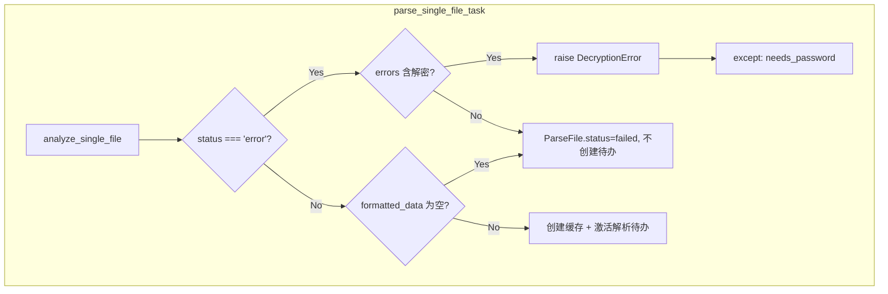

# 不支持文件与空解析结果处理方案

## 问题根因

当前解析管线（`BillParsingPipeline`）在任意步骤失败时，通过 `Step._error()` 设置 `context['status'] = 'error'` 并**返回**，不会抛出异常。任务 `parse_single_file_task` 未检查 `result_context['status']`，直接使用 `formatted_data`（失败时为初始空列表 `[]`）创建缓存并激活解析待办。结果是：

- 不支持的文件类型（错误扩展名、ZIP 内无支持格式）→ 生成空待办
- 不支持的账单类型（首行不匹配任何策略）→ 生成空待办  
- 加密文件缺密码（DecryptionError）→ 同样走 `_error()` 返回，未进入任务的 `except`，无法标记为 `needs_password`

用户点击「跳过」时，`ParseReviewConfirmView` 调用 `get_final_result()`，空列表或缓存缺失导致返回 404：「解析结果不存在或已过期，请重新解析」。

## 支持文件的判断逻辑（两层）

| 层级  | 判断位置                                                 | 失败原因                                                      | 异常/错误                                        |
| --- | ---------------------------------------------------- | --------------------------------------------------------- | -------------------------------------------- |
| 格式层 | `ConvertToCSVStep` → `convert_to_csv_bytes`          | 扩展名不在 `.csv/.xls/.xlsx/.pdf/.zip`；ZIP 内无支持文件；PDF/ZIP 解密失败 | `UnsupportedFileTypeError`、`DecryptionError` |
| 内容层 | `InitializeBillStep` → `InitFactory.create_strategy` | 首行不匹配支付宝/微信/工行/建行/中行/招行任一策略                               | `ValueError("当前账单不支持")`                      |

无法在上传时完全预判，需通过解析管线执行结果判断。

## 交互设计原则

- **加密文件（需密码）**：标记为 `needs_password`，在任务进度弹窗中提供「输入密码」重试。
- **不支持格式/账单类型**：不创建解析待办，将 `ParseFile.status` 设为 `failed`，`error_message` 记录具体原因，文件列表显示「解析失败」。
- **空解析结果**（格式和内容均支持，但过滤后无有效交易）：不创建解析待办，标记为 `failed`，提示「未解析到有效交易记录」。

## 实现方案

### 1. 任务层：解析失败时不再创建空待办

在 `[project/apps/translate/tasks.py](Beancount-Trans-Backend/project/apps/translate/tasks.py)` 中，`result_context = service.analyze_single_file(...)` 之后：

- **检查 `context['status'] == 'error'`**  
  - 从 `context['errors']` 判断错误类型：
    - 若包含「解密」「Decryption」「PDF解密」「ZIP 解密」等 → 主动 `raise DecryptionError(...)`，由现有 `except` 分支标记为 `needs_password`。
    - 否则 → 视为不支持/解析失败：`parse_file.status = 'failed'`，`error_message = errors[-1]`，更新 Redis 状态为 `failed`，**不**创建缓存、**不**激活 ScheduledTask，直接 `return`。
- **检查 `formatted_data` 为空**  
  - 若 `status != 'error'` 且 `len(formatted_data) == 0`：视为「无有效交易」，不创建解析待办，`parse_file.status = 'failed'`，`error_message = '未解析到有效交易记录'`，直接 `return`。
- **仅在 `status != 'error'` 且 `len(formatted_data) > 0` 时**：按现有逻辑创建缓存、写入 `ParseReviewService`、激活解析待办。

### 2. 步骤层：让 DecryptionError 可被任务区分

当前 `ConvertToCSVStep` 对 `DecryptionError` 使用 `_error()`，错误信息为 `"文件转换失败: {str(e)}"`，其中 `str(e)` 已包含「解密失败」等字样，任务层通过 `errors` 文本即可识别。无需修改步骤实现，保持现状即可。

若希望更明确，可在 `context['errors']` 中附带错误类型标识（如 `error_code: 'decryption'`），任务层优先根据该字段判断，再回退到文本匹配。此为可选增强。

### 3. 前端：状态展示与错误提示

- 在 `[FileManage.vue](Beancount-Trans-Frontend/src/components/file/FileManage.vue)` 的 `translateStatus`、`statusTagType`、`getStatusColor` 中，`failed` 已存在，无需新增状态。
- 任务进度弹窗中，对 `status === 'failed'` 的任务，可在操作列展示「解析失败」标签，并支持 `el-tooltip` 显示 `error` 字段中的具体原因（如「当前账单不支持」「未解析到有效交易记录」）。
- 待办列表页（`[ReconciliationList.vue](Beancount-Trans-Frontend/src/views/reconciliation/ReconciliationList.vue)`）：解析待办仅对「有有效解析结果」的任务创建，因此不再出现「空结果 + 跳过失败」的情况。若后端未创建待办，对应任务不会出现在列表中。

## 数据流示意

## 涉及文件

- `[Beancount-Trans-Backend/project/apps/translate/tasks.py](Beancount-Trans-Backend/project/apps/translate/tasks.py)`：在 `result_context` 后增加 `status` / `formatted_data` 校验及 DecryptionError 重抛逻辑。
- `[Beancount-Trans-Frontend/src/components/file/FileManage.vue](Beancount-Trans-Frontend/src/components/file/FileManage.vue)`：对 `failed` 任务展示 `error` 提示（可选，提升体验）。

## 测试要点

1. 上传扩展名不支持的文件（如 `.txt`）→ 解析后应显示「解析失败」，不出现解析待办。
2. 上传格式正确但首行不匹配任何策略的 CSV → 同上。
3. 上传加密 PDF/ZIP 且不提供密码 → 应显示「需要密码」，可点击「输入密码」重试。
4. 上传加密文件并正确提供密码 → 正常解析并生成待办。
5. 上传支持格式且内容正确、但过滤后无交易的文件 → 显示「解析失败」，不生成待办。

