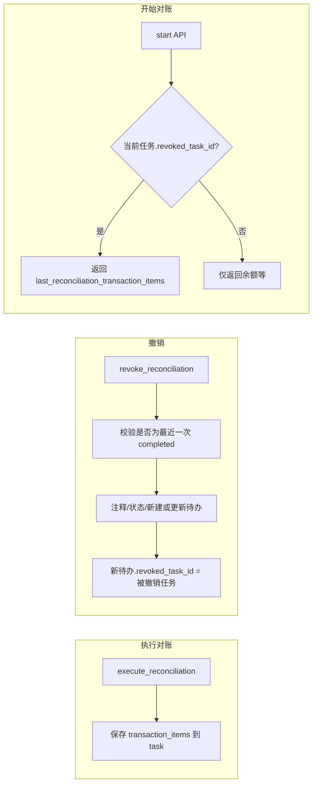

# 只允许撤销最近一次对账并预填差额分配

## 1. 目标

- **只允许撤销最近一次对账**：后端校验当前被撤销的任务必须是该账户按 `as_of_date` 降序的最近一条 `completed` 记录；否则返回 400，提示「仅支持撤销最近一次对账，更早的对账请在 Fava 中处理」。
- **不展示历史对账**：前端移除「对账 → 历史」Tab 及已完成列表，用户不再从列表进入撤销。
- **撤销入口在对账表单**：进入任意该账户的待办对账表单时，**仅**在以下两种情况下展示「撤销上一次对账」按钮；点击后调用撤销 API，成功后跳转到新任务的对账表单：
提交的对账日期 `as_of_date` 与上一次对账日期相同时；
- 差额分配中某个条目的日期在上一次对账日期或之前时。
- **撤销后表单预填原差额分配**：执行对账时把当次 `transaction_items` 存库；撤销后生成/更新的待办在「开始对账」时返回这些条目，前端预填差额分配区。

## 2. 数据流概览

## 3. 后端改动

### 3.1 模型

- **ScheduledTask**（`[models.py](Beancount-Trans-Backend/project/apps/reconciliation/models.py)`）：
  - 新增 `reconciliation_transaction_items`（JSONField, null=True, blank=True）：存当次执行对账时的 `transaction_items`，结构为 `[{ "account", "amount", "is_auto", "date" }]`，`amount`/`date` 以字符串形式存（如 ISO 日期）。
  - 新增 `revoked_task_id`（ForeignKey('self', null=True, blank=True, on_delete=models.SET_NULL)）：撤销后新建或更新的待办指向被撤销的那条任务，用于在 start 时取回预填数据。
- 不生成迁移也不应用迁移，由用户自行处理。

### 3.2 只允许撤销最近一次

- 在 `[ReconciliationService.revoke_reconciliation](Beancount-Trans-Backend/project/apps/reconciliation/services/reconciliation_service.py)` 开头（在注释账本之前）：
  - 查询该账户下 `status='completed'`、`task_type='reconciliation'` 的任务，按 `as_of_date` 降序取第一条。
  - 若该条 `id != task.id`，则 `raise ValueError("仅支持撤销最近一次对账，更早的对账请在 Fava 中处理")`。
- 视需要将错误信息在 `[views.revoke_reconciliation](Beancount-Trans-Backend/project/apps/reconciliation/views.py)` 中通过 400 返回给前端。

### 3.3 执行对账时写入 transaction_items

- 在 `[ReconciliationService.execute_reconciliation](Beancount-Trans-Backend/project/apps/reconciliation/services/reconciliation_service.py)` 中，在写入 `task.reconciliation_entries` 的同一段逻辑里：
  - 将入参 `transaction_items` 序列化为可 JSON 存储的列表（如 `amount` 转为 str，`date` 转为 isoformat 或 None），写入 `task.reconciliation_transaction_items`。
  - 若无差额（`transaction_items` 为空或未传），可存为 `[]` 或 `null`。

### 3.4 撤销时关联被撤销任务

- 在 `revoke_reconciliation` 中，在「更新或新建待办」时：
  - 若为新建：`ScheduledTask.objects.create(..., revoked_task_id=task.id)`。
  - 若为更新已有 pending：`existing_pending.revoked_task_id = task.id` 并 `save`。

### 3.5 开始对账时返回预填差额

- 在 `[views.start](Beancount-Trans-Backend/project/apps/reconciliation/views.py)` 中，组装返回数据时：
  - 若 `task.revoked_task_id` 非空且 `task.revoked_task_id.reconciliation_transaction_items` 非空，则将该列表放入响应，字段名如 `last_reconciliation_transaction_items`（结构与前端 `TransactionItem` 一致：account, amount, is_auto, date）。
- 在 `[ReconciliationStartSerializer](Beancount-Trans-Backend/project/apps/reconciliation/serializers.py)` 中增加可选字段：`last_reconciliation_transaction_items = TransactionItemSerializer(many=True, required=False)`（或等价结构），用于序列化该列表。

## 4. 前端改动

### 4.1 移除历史对账列表

- 在 `[ReconciliationList.vue](Beancount-Trans-Frontend/src/views/reconciliation/ReconciliationList.vue)`：
  - 移除「对账子筛选：待办 / 历史」的 `el-radio-group` 及 `reconciliationSubFilter` 相关逻辑。
  - 待办列表仅请求并展示 `status=pending`、`due=true` 的对账任务（保持现有行为），不再请求 `status=completed`。
  - 删除与「历史」相关的空状态文案、已完成卡片模板（含「撤销对账」按钮）、以及 `revokingTaskIds` / `handleRevokeReconciliation` 在列表中的使用（若仅历史用则可删，见下）。

### 4.2 对账表单内撤销入口与预填

- 在 `[ReconciliationForm.vue](Beancount-Trans-Frontend/src/views/reconciliation/ReconciliationForm.vue)`：
  - **开始对账响应**：类型与请求处需支持新字段 `last_reconciliation_transaction_items?: TransactionItem[]` 以及 `last_completed_task_id`。start 接口需返回该账户最近一条 status=completed 的对账任务 id（若无则为 null），以便前端调用 `revokeReconciliation(last_completed_task_id)`。
- **start 接口扩展**（后端）：除 `last_reconciliation_transaction_items` 外，返回 `last_completed_task_id`（该账户最近一条 status=completed 的对账任务 id，若无则为 null）。
- **表单逻辑**：
  - 在 `loadReconciliationData` 中：若 `response.data.last_reconciliation_transaction_items` 存在且长度 > 0，则用其初始化 `formData.transactionItems`（将 account 转为 accountId 可沿用现有 AccountSelector 逻辑或按 account 名匹配）；若存在但为空数组，可保留默认一行或清空。
  - 存储 `lastCompletedTaskId`、`lastReconciliationDate`（start 已返回）。
- **撤销按钮显示条件**（仅满足以下任一条件时显示）：
  1. **条件 1**：提交的对账日期 `as_of_date` 与上一次对账日期相同。表单中 `as_of_date` 由 `reconciliationTiming` 决定：`start_of_next_day` → today-1，`end_of_day` → today。需新增计算属性 `computedAsOfDate` 与提交逻辑一致。
  2. **条件 2**：差额分配中某个条目的 `date` 在上一次对账日期或之前（`item.date && item.date <= lastReconciliationDate`）。
  - 新增计算属性 `showRevokeButton`：`lastCompletedTaskId` 和 `lastReconciliationDate` 均有值，且（`computedAsOfDate === lastReconciliationDate` 或 `transactionItems.some(item => item.date && item.date <= lastReconciliationDate)`）。
  - 在操作按钮区增加「撤销上一次对账」按钮，`v-if="showRevokeButton"`。点击后确认框，调用 `revokeReconciliation(lastCompletedTaskId)`，成功后用返回的 `new_task_id` 跳转到 `/reconciliation/{new_task_id}`。
- **类型**：在 `[types/reconciliation.ts](Beancount-Trans-Frontend/src/types/reconciliation.ts)` 的 `ReconciliationStartResponse` 中增加 `last_reconciliation_transaction_items?: TransactionItem[]` 和 `last_completed_task_id?: number | null`。

### 4.3 差额分配草稿持久化（防止返回导致信息丢失）

- **目标**：用户填写差额分配后，若误点「返回」或浏览器后退，数据不丢失，再次进入时可恢复。
- **方案**：使用 `sessionStorage` 按任务 ID 存储草稿，项目未使用 Pinia，采用 composable + sessionStorage 即可。
- **存储 key**：`reconciliation_draft_${taskId}`。
- **存储内容**：`{ actualBalance, currency, reconciliationTiming, transactionItems }`（用户可编辑的核心字段，JSON 序列化）。
- **保存时机**：
  - 使用 `watch` 监听 `formData` 变化，`debounce`（如 300ms）后写入 sessionStorage。
  - 或仅在 `actualBalance`、`transactionItems` 有实质变更时保存（避免空表单覆盖有效草稿）。
- **恢复时机**：`loadReconciliationData` 完成后，若 `last_reconciliation_transaction_items` 为空（无服务端预填），则检查 sessionStorage 是否有该 taskId 的草稿；若有，弹窗「检测到未保存的差额分配草稿，是否恢复？」，用户确认后合并到 `formData`（注意 account 需匹配 accountId，可先按 account 字符串匹配账户树）。
- **清除时机**：提交成功后调用 `sessionStorage.removeItem(key)`；若用户选择「不恢复」草稿，可一并清除。
- **离开确认**：`onBeforeRouteLeave` 中，若存在未提交的差额分配数据（如 `actualBalance` 已填或 `transactionItems` 有非空条目），弹窗「有未保存的差额分配数据，确定要离开吗？」，用户确认后再离开。
- **实现位置**：可抽取 `useReconciliationDraft(taskId)` composable，封装保存/恢复/清除逻辑，在 `ReconciliationForm.vue` 中调用。

## 5. 执行顺序建议

1. 后端：模型新增 `reconciliation_transaction_items`、`revoked_task_id`，迁移。
2. 后端：`execute_reconciliation` 写入 `reconciliation_transaction_items`；`revoke_reconciliation` 增加「仅允许撤销最近一次」校验，并在新建/更新待办时设置 `revoked_task_id`。
3. 后端：start 接口根据 `task.revoked_task_id` 返回 `last_reconciliation_transaction_items`，并返回该账户 `last_completed_task_id`（最近一条 completed 的 id）。
4. 前端：移除历史 Tab 与列表中的撤销，start 类型与表单预填、撤销按钮与跳转。
5. 前端：实现差额分配草稿持久化（composable + sessionStorage + beforeRouteLeave）。
6. 单测：后端校验「非最近一次撤销」返回 400；撤销后 start 返回预填数据；前端可做简单集成或 E2E 覆盖。

## 6. 边界说明

- **重复对账同一日期报错**：若前端在 execute 时因「该账户已有 xxx 的对账记录」被拒，可在错误提示中增加「若需重做该日对账，请在对账页点击「撤销上一次对账」后再提交」，无需单独新接口，只需文案与入口一致。
- **只撤销最近一次**：用户无法在界面撤销更早的对账，与「更早的在 Fava 中处理」一致。
- **草稿作用域**：sessionStorage 按 taskId 隔离，关闭标签页后草稿失效；多标签页同 taskId 会共享同一 key，以最后写入为准。
- **撤销按钮显示条件小结**：

| 场景                  | 条件 1（as_of_date = 上次对账日期） | 条件 2（某条目 date ≤ 上次对账日期） | 显示撤销 |
| ------------------- | ------------------------- | ----------------------- | ---- |
| 用户选择的对账日期 = 上次对账日期  | ✓                         | -                       | ✓    |
| 差额分配中某条目日期 ≤ 上次对账日期 | -                         | ✓                       | ✓    |
| 两者都不满足              | ✗                         | ✗                       | ✗    |

