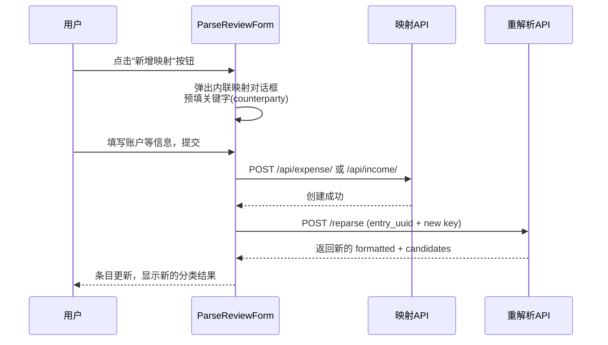

# 解析审核页面内联新增映射

## 问题分析

在解析审核页面 `ParseReviewForm.vue` 中，AI 分类反馈区域展示候选关键字及其匹配分数。当某条交易的关键字在支出/收入映射表中不存在时，会出现"无候选分类"或候选列表中没有合适选项的情况，用户无法直接解决。

当前候选列表来自 `ExpenseHandler._process_expense()` / `_process_income()`，它在 `counterparty`（商户）和 `commodity`（商品名）中搜索已有映射的 `key`。如果没有匹配的映射 key，则无候选。

## 现有可复用能力

- `**AccountSelector.vue**` 组件：已有的级联账户选择器，支持 `accountType` 过滤（Expenses/Income/Assets）
- **映射创建 API**：`POST /api/expense/`（需要 `key`, `expend_id`, `payee`, `currency`）、`POST /api/income/`（需要 `key`, `income_id`, `payer`）
- **重解析 API**：`POST /api/translate/parse-review/{taskId}/reparse`（传入 `entry_uuid` + `selected_key`）
- `**original_row`** 数据：每条 `FormattedEntry` 都有 `original_row`，包含 `counterparty`、`commodity`、`transaction_type` 等原始账单字段，可用于预填关键字

## 方案设计

### 交互流程

### 1. 前端：审核页面新增映射对话框

**文件**: `[ParseReviewForm.vue](Beancount-Trans-Frontend/src/views/parse-review/ParseReviewForm.vue)`

在 AI 分类反馈区域（候选分类标签后面）添加"新增映射"按钮。点击后弹出对话框：

- **关键字**（text input）：从 `original_row.counterparty` 预填，用户可自行修改
- **映射类型**（select）：支出映射 / 收入映射，根据 `original_row.transaction_type` 自动推断默认值
- **映射账户**（AccountSelector）：复用已有的 `AccountSelector.vue`，根据映射类型自动过滤账户类型（Expenses / Income）
- **收款方/付款方**（可选 text input）：支出映射时显示"收款方"（预填 `counterparty`），收入映射时显示"付款方"

提交逻辑：

1. 调用映射创建 API（`POST /api/expense/` 或 `POST /api/income/`）
2. 创建成功后，自动调用 `reparseEntry(taskId, { entry_uuid, selected_key: newKey })` 重解析
3. 更新前端表格中对应条目的数据

### 2. 前端：类型定义

**文件**: `[types/parse-review.ts](Beancount-Trans-Frontend/src/types/parse-review.ts)`

为内联映射表单添加类型定义。`original_row` 需要一个更具体的类型（至少包含 `counterparty`、`commodity`、`transaction_type`）。

### 3. 后端无需新增接口

所有所需 API 已存在：

- 映射创建：`POST /api/expense/`、`POST /api/income/`（由 `BaseMappingViewSet` 提供）
- 重解析：`POST /api/translate/parse-review/{taskId}/reparse`（已有）

重解析时 `MappingDataProvider` 会重新从数据库加载映射，所以新建的映射会被自动读取。

## UI 设计

在每条条目的"AI分类反馈"列中，候选分类标签区域后新增一个"+ 新增映射"按钮（小型、朴素风格）。对话框设计参考 `MappingManagement.vue` 中已有的快速创建对话框样式，保持一致性。