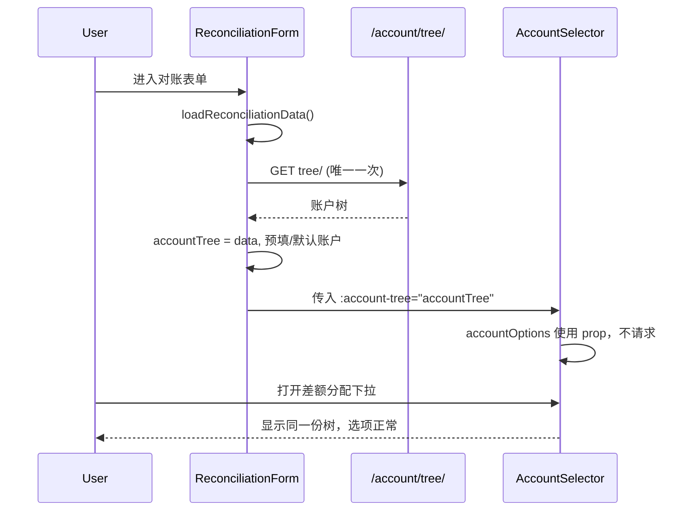

# 对账表单 tree/ 重复请求与差额分配账户不显示

## 问题分析

### 1. 为何会请求 3 次 tree/

进入对账表单时的调用链如下：

| 来源    | 位置                                                                                                                              | 说明                                                                                                                   |
| ----- | ------------------------------------------------------------------------------------------------------------------------------- | -------------------------------------------------------------------------------------------------------------------- |
| 第 1 次 | [ReconciliationForm.vue](Beancount-Trans-Frontend/src/views/reconciliation/ReconciliationForm.vue) 内 `loadReconciliationData()` | 第 318–320 行：若 `accountTree.value.length === 0` 则 `await loadAccounts()`，用于预填/默认账户时按名称查 id                            |
| 第 2 次 | [ReconciliationForm.vue](Beancount-Trans-Frontend/src/views/reconciliation/ReconciliationForm.vue) 的 `onMounted`                | 第 262–263 行：`await loadReconciliationData()` 之后又 `await loadAccounts()`，与上面重复                                        |
| 第 3 次 | [AccountSelector.vue](Beancount-Trans-Frontend/src/components/common/AccountSelector.vue) 的 `onMounted`                         | 第 328–355 行：通过 `requestIdleCallback`（或 100ms `setTimeout`）异步调用 `fetchAccountTree()`，每个表格行一个 AccountSelector 至少触发 1 次 |

即：表单自身在「loadReconciliationData 内 + onMounted 尾」各拉一次，表格里的 AccountSelector 再独立拉一次，共 3 次。

### 2. 为何差额分配里账户会“不显示”（偶发）

- **两套数据、两套请求**  
  - 表单侧：`ReconciliationForm` 的 `accountTree` 只用于 `findAccountByName`、设置 `row.accountId`/`row.account` 和默认项。  
  - 展示侧：下拉选项来自 **AccountSelector 内部的** `accountTree`，由自己的 `fetchAccountTree()` 填充，与表单的 `accountTree` 完全独立。
- **偶发原因**  
  - AccountSelector 在 `requestIdleCallback` 里才拉 tree，存在延迟；若用户很快展开「差额分配」并点开下拉，可能拉取未完成或失败。  
  - 下拉打开时 `handleVisibleChange` 会再触发一次 `fetchAccountTree()`，多请求并行，任一失败或返回空都会导致 `accountTree` 被置为 `[]`，下拉为空。  
  - 表单可能已用自家的 `accountTree` 把 `row.accountId` 设好，但 AccountSelector 的 options 仍为空，表现为“有选中 id 但下拉里没有选项/列表为空”。

因此：**不显示** 的是 AccountSelector 的级联选项，根因是子组件自管一份 tree、与父组件不同步，且存在请求时序/失败导致的空状态。

---

## 方案概述

- **合并 tree/ 为一次请求**：只在表单内拉一次账户树，并让差额分配里的 AccountSelector 使用这份数据，不再自己请求。
- **支持“注入树”**：AccountSelector 增加可选 prop（如 `accountTree`），当父组件传入且有效时，直接使用该数据、不请求 tree/；未传入时保留现有“自拉”逻辑，兼容其他页面。

这样进入对账表单只会发 1 次 tree/，且下拉选项与表单预填/默认账户共用同一份树，避免竞态和空列表。

---

## 实现要点

### 1. ReconciliationForm：只拉一次 tree/

- **保留**在 `loadReconciliationData()` 内、在需要按名称查 id 之前的那次 `loadAccounts()`（即当前 318–320 行的逻辑），作为**唯一**拉取时机。
- **删除** `onMounted` 末尾的 `await loadAccounts()`（约 263 行），避免第二次请求。
- 保证在 `loadReconciliationData()` 里先 `await loadAccounts()`，再执行预填、默认账户等逻辑（顺序已满足即可）。

### 2. AccountSelector：支持外部注入 accountTree

- 新增可选 prop，例如：`accountTree?: AccountOption[] | null`。
- **计算选项**：  
  - 若 `accountTree` prop 有值（如 `Array.isArray(accountTree) && accountTree.length > 0`），则 `accountOptions` 使用该 prop（再按现有 `accountType` 过滤）。  
  - 否则使用组件内部的 `accountTree` ref（现有逻辑）。
- **请求行为**：  
  - 当存在有效的 `accountTree` prop 时：不在 `onMounted` 中调用 `fetchAccountTree()`，也不在 `handleVisibleChange` 中因“树为空”而请求。  
  - 未传入或传入空时：保持现有“按需/空闲时拉取”行为，以便其他使用处不受影响。
- 类型：与现有 `AccountOption` 一致，可从当前接口定义复用或从父组件类型导入，保证 `id/account/children` 等结构一致。

### 3. ReconciliationForm 使用注入方式

- 在模板中为差额分配表格里的 AccountSelector 传入表单的账户树，例如：  
`:account-tree="accountTree"`（或实际采用的 prop 名）。
- 这样该页内所有 AccountSelector 实例都使用同一份 `accountTree`，不再各自请求 tree/，且与 `findAccountByName` 使用的数据一致。

### 4. 可选：错误与加载状态

- 若希望“不显示”时更易排查，可在 AccountSelector 中：当使用注入的 `accountTree` 且树为空数组时，不显示“加载中”，可显示“暂无账户”或占位提示（按产品需求决定是否做）。
- 表单侧 `loadAccounts()` 失败时已有 `accountTree.value = []` 和 `loadReconciliationData` 的 catch（如 router.back），可保持现状或统一在 loadReconciliationData 里提示一次“账户列表加载失败”。

---

## 数据流（修改后）

---

## 涉及文件

- [Beancount-Trans-Frontend/src/views/reconciliation/ReconciliationForm.vue](Beancount-Trans-Frontend/src/views/reconciliation/ReconciliationForm.vue)：删除 onMounted 中多余的 `loadAccounts()`；给表格内 AccountSelector 传 `accountTree`。
- [Beancount-Trans-Frontend/src/components/common/AccountSelector.vue](Beancount-Trans-Frontend/src/components/common/AccountSelector.vue)：新增可选 prop `accountTree`；有值时用 prop 作为选项来源并跳过 fetch；无值时保持原有请求逻辑。

---

## 小结

- **3 次请求**：表单内 2 次（loadReconciliationData 内 1 次 + onMounted 1 次）+ 每个 AccountSelector 1 次。合并后仅在表单的 `loadReconciliationData` 中请求 1 次。
- **账户不显示**：差额分配下拉依赖 AccountSelector 自己的 tree，与表单不同步且请求可能延迟/失败。通过表单只拉一次 tree 并注入给 AccountSelector，保证数据一致并消除竞态，避免偶发空列表。

