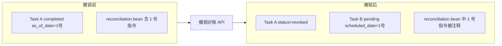

# 撤销对账与重新对账方案

## 1. 目标与约束

- **业务目标**：用户发现某次对账漏记条目（如 1 号还款）时，可撤销该次对账、补记交易后，对同一日期重新对账。
- **现有约束**：`[ReconciliationExecuteSerializer.validate](Beancount-Trans-Backend/project/apps/reconciliation/serializers.py)` 中通过「该账户已完成对账中最大的 as_of_date」禁止 `as_of_date` 重复；需改为：仅统计**未撤销**的已完成对账。
- **账本一致性**：撤销后必须让该次对账写入的 balance/pad/transaction 在 Beancount 中失效，否则会与重新对账产生冲突；做法是在 `trans/reconciliation.bean` 中注释掉当次写入的指令块。
- **Git 集成约束**：`trans/reconciliation.bean` 与 Git 仓库集成，Git 同步时会调用 `ReconciliationCommentService.detect_and_comment_duplicates`，将平台写入的、与 Git 已提交内容重复的条目注释掉。因此**不能依赖写入时的行号**撤销——行号可能因 Git 同步、用户手动编辑而失效。应采用**基于内容匹配**的撤销：写入时记录条目的标准化表示，撤销时解析文件、匹配条目、再注释。

## 2. 架构概览

- 撤销 = 原任务标记为 `revoked` + 账本中注释当次指令 + 将已存在的同账户的  pending 待办 `scheduled_date` 修改为 `当天日期`  或 新建一条同账户、`scheduled_date = 当天日期` 的 pending 待办。
- 用户对「新待办」执行对账时，提交的 `as_of_date` 仍为该日；校验层只认「未撤销的 completed」，故允许通过并再次写入新指令。

## 3. 后端改动

### 3.1 数据模型

- **ScheduledTask 增加状态**  
在 `[models.py](Beancount-Trans-Backend/project/apps/reconciliation/models.py)` 的 `STATUS_CHOICES` 中增加 `('revoked', '已撤销')`。仅对 `task_type='reconciliation'` 且原 `status='completed'` 的任务可变为 `revoked`。
- **记录当次对账写入的条目（标准化表示）**  
在 `ScheduledTask` 上增加可空字段 `reconciliation_entries`（JSONField, null=True, blank=True）：  
存储当次写入的 Beancount 条目的标准化表示（`EntryMatcher.normalize_entry` 的输出结构），用于撤销时在文件中通过内容匹配定位并注释。  
新建迁移并写清字段用途，历史数据保持为 null。

### 3.2 对账执行时记录条目

- 在 `[ReconciliationService.execute_reconciliation](Beancount-Trans-Backend/project/apps/reconciliation/services/reconciliation_service.py)` 中，`_append_directives` 写入成功后：
  1. 使用 Beancount loader 解析 `trans/reconciliation.bean`，获取该文件中的 Transaction/Pad/Balance 条目。
  2. 筛选「本次写入」的条目：按 `as_of_date`、`as_of_date + 1`（balance 日期）以及 `"Beancount-Trans"` 标识，取最后 N 条（N = 本次生成的 directive 数量，即 transaction + pad + balance 的条数）。
  3. 对每条条目调用 `EntryMatcher.normalize_entry`，得到标准化 dict；将列表序列化为 JSON 存入 `task.reconciliation_entries`。
- 注意：`EntryMatcher.normalize_entry` 输出中的 `date`、`Decimal` 等需在存入 JSON 前序列化（如 `date.isoformat()`、`str(decimal)`），撤销时反序列化后再与解析结果比较；或在使用 `match_entry_lists` 前将双方统一为可比较格式。

### 3.3 校验层排除已撤销任务

- 在 `[ReconciliationExecuteSerializer.validate](Beancount-Trans-Backend/project/apps/reconciliation/serializers.py)` 中，计算「该账户已完成对账中最大 as_of_date」时，当前查询条件为 `status='completed'`；保持不变，但**排除** `status='revoked'` 的同一账户对账任务（即只统计 `status='completed'`，不把 `revoked` 当作已完成）。  
若后续在别处有「最近一次有效对账」的查询（如 start 接口的 `last_reconciliation_date`），同样只考虑 `status='completed'`，不考虑 `revoked`。
- 在 `[views.py](Beancount-Trans-Backend/project/apps/reconciliation/views.py)` 的 `start` 中，获取「上一次对账日期」的查询已用 `status='completed'`，确认排除 `revoked`。

### 3.4 撤销对账 API 与逻辑

- **新 action**：在 `ScheduledTaskViewSet` 上增加 `@action(detail=True, methods=['post'])`，例如 `revoke_reconciliation`。
  - 权限与过滤：与现有对账接口一致（当前用户、同一账户维度）。
  - 校验：仅当 `task.task_type == 'reconciliation'` 且 `task.status == 'completed'` 时允许调用；否则 400。
  - 逻辑（建议放在新方法 `ReconciliationService.revoke_reconciliation(task)` 中，便于单测）：
    1. **注释账本（基于内容匹配）**：
      - 若 `task.reconciliation_entries` 非空：复用 `ReconciliationCommentService._parse_reconciliation_bean` 解析 `trans/reconciliation.bean`，得到 `platform_entries` 与 `entry_to_lines`。将 `task.reconciliation_entries` 反序列化为标准化条目列表，与 `platform_entries` 使用 `EntryMatcher.match_entry_lists` 匹配。对匹配到的平台条目，收集其 `line_numbers`，调用 `_comment_lines_in_file` 注释（与 `detect_and_comment_duplicates` 一致，已注释行会跳过）。
      - 若 `task.reconciliation_entries` 为空（历史任务）：仅更新任务状态并创建新待办，不修改账本；响应中可包含 `entries_commented: 0` 及 `message` 说明「该记录未存储条目信息，无法自动注释账本，请手动检查 trans/reconciliation.bean」。
    2. **更新任务**：`task.status = 'revoked'`，`task.save()`。
    3. **更新或新建待办**，保证永远只有一个 pending 待办且日期为当天
      1. **更新待办**：若已有同账户的 `status = pendding` 任务，则将该任务的 `scheduled_date` 修改为当天日期
      2. **新建待办**：同账户创建一条 `ScheduledTask`：`task_type='reconciliation'`，`content_type`/`object_id` 与当前账户一致，`scheduled_date = 当天日期`，`status='pending'`，`completed_date`/`as_of_date` 为空。
  - 响应：返回 200，body 中包含 `new_task_id`、`entries_commented`（实际注释的行数）、`message`（可选），便于前端展示或跳转。
- **路由**：无需改 url 配置，DRF 会生成 `POST /reconciliation/tasks/{id}/revoke_reconciliation/`。

**兼容 Git 场景**：若 Git 同步已通过 `detect_and_comment_duplicates` 注释了部分或全部当次条目，解析时 Beancount 会跳过已注释行，`platform_entries` 中不包含这些条目，匹配结果为空，`entries_commented` 为 0。此时条目已失效，无需再注释；任务状态更新和新建待办仍正常执行。

### 3.5 测试与边界

- **单测**：  
  - 执行对账后检查 `reconciliation_entries` 已写入且与本次生成的 transaction/pad/balance 条目的标准化形式一致。  
  - 撤销后：原任务为 `revoked`；新任务存在且 `scheduled_date == 当天日期`；账本中当次条目已被注释；再次对同一 as_of_date 执行对账应通过校验并成功。  
  - 无 `reconciliation_entries` 的历史任务撤销：仅更新状态并创建新待办，`entries_commented` 为 0，响应中说明无法自动注释。
  - Git 场景：模拟 `detect_and_comment_duplicates` 已注释当次条目后，再执行撤销，应正常完成（匹配为空，不重复注释）。
- **边界**：若用户大幅修改条目内容导致无法匹配，撤销仍会更新状态并创建新待办，但 `entries_commented` 为 0；可在文档中说明「若账本已被手动修改，可能无法自动注释，请手动检查」。

## 4. 前端改动

### 4.1 API 与类型

- 在 `[api/reconciliation.ts](Beancount-Trans-Frontend/src/api/reconciliation.ts)` 中新增 `revokeReconciliation(taskId: number)`，请求 `POST /reconciliation/tasks/{id}/revoke_reconciliation/`，返回类型包含 `new_task_id`（及可选 `scheduled_date`）。
- 在 `[types/reconciliation.ts](Beancount-Trans-Frontend/src/types/reconciliation.ts)` 的 `TaskStatus` 中增加 `REVOKED = 'revoked'`，并在 `TaskStatusLabels` 中增加「已撤销」；若列表/详情会展示状态，需能显示该值。

### 4.2 入口与交互

- **入口**：仅在「对账」类任务且状态为「已完成」时展示「撤销对账」按钮。当前待办列表主要展示 `status=pending`；需在「对账历史」或「已完成」列表中提供撤销入口（若现有只有「待办列表」，可考虑在任务详情或单独「历史」Tab 中列出已完成对账，再提供撤销）。
- **交互**：点击「撤销对账」后，用 `ElMessageBox.confirm` 确认（说明将作废该次对账并允许重新对账该日）。确认后调用 `revokeReconciliation(id)`，成功则提示「已撤销，可对同一日期重新对账」，并刷新列表或跳转到新任务（用返回的 `new_task_id` 打开对账表单或高亮新卡片）。
- 若后端返回错误（如任务类型/状态不符），前端用 `ElMessage` 展示。成功时可根据 `entries_commented` 展示不同提示（如「已撤销并注释 N 行」或「已撤销，该记录无法自动注释账本，请手动检查」）。

## 5. 文档与产品说明

- 在用户文档中补充「撤销对账」说明：适用场景（漏记、错记需重做）、操作步骤、以及「撤销后账本中当次指令会被注释，需对同一日期重新执行一次对账」。
- 可选：在 API 文档（如 OpenAPI）中为 `revoke_reconciliation` 增加描述和示例响应。

## 6. 实现顺序建议

1. 模型：增加 `revoked` 状态与 `reconciliation_entries`（JSONField），迁移。
2. 服务层：`execute_reconciliation` 写入成功后解析文件、提取当次条目、标准化并存入 `task.reconciliation_entries`；新增 `revoke_reconciliation` 实现基于内容匹配的注释 + 状态更新 + 新建待办。
3. 校验与视图：serializer 仅统计非 revoked 的 completed；ViewSet 增加 `revoke_reconciliation` action。
4. 后端单测：执行对账后 `reconciliation_entries` 正确；撤销流程（含内容匹配、历史任务、Git 已注释场景）；同一 as_of_date 再次执行通过。
5. 前端：类型与 API、撤销按钮与确认、成功后的刷新/跳转。
6. 文档与错误提示完善。

## 7. 与「同一天不能对账两次」的关系

- **原意**：同一账户、同一 `as_of_date` 不允许有两条「有效」对账记录。
- **实现**：有效 = 已完成且未撤销。撤销后，原记录变为 `revoked`，不再参与「最大 as_of_date」统计，因此同一 `as_of_date` 可以再次提交；新待办的执行会生成新的指令并写入新的行号范围，实现「重新对账法」而不破坏「同一天只保留一次有效对账」的语义。

