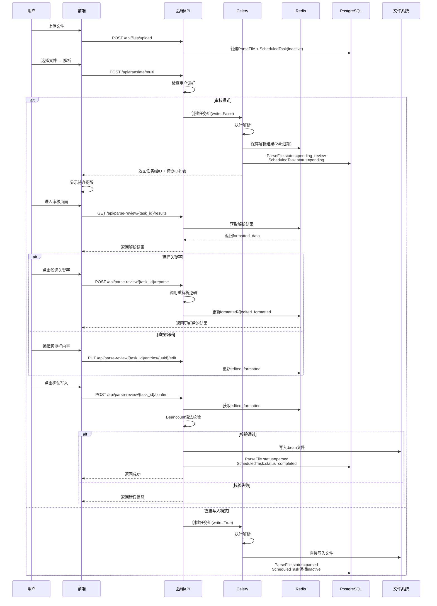

# 解析审核功能实现计划

## 概述

根据需求文档，实现多文件批量解析的审核功能，核心包括：

1. 解析模式偏好设置（审核模式/直接写入模式）
2. 解析待办任务生成和管理
3. 解析结果审核页面（关键字选择、条目编辑、实时预览）
4. 待办列表扩展支持解析待办
5. 到期自动确认写入机制

## 后端实现

### 1. 数据模型扩展

#### 1.1 扩展 FormatConfig 模型

**文件**: `Beancount-Trans-Backend/project/apps/translate/models.py`

- 添加 `parsing_mode_preference` 字段（CharField，choices: 'review'/'direct_write'，默认 'review'）

#### 1.2 扩展 ScheduledTask 模型

**文件**: `Beancount-Trans-Backend/project/apps/reconciliation/models.py`

- 在 `TASK_TYPE_CHOICES` 中添加 `('parse_review', '解析审核')`
- 在 `STATUS_CHOICES` 中添加 `('inactive', '未激活')`
- 更新 `get_pending_tasks` 方法，支持解析待办的筛选逻辑（基于 `status='pending'` 和 `task_type='parse_review'`）

#### 1.3 扩展 ParseFile 模型

**文件**: `Beancount-Trans-Backend/project/apps/translate/models.py`

- 在 `status` choices 中添加 `('pending_review', '待审核')`

### 2. 文件上传时创建解析待办

**文件**: `Beancount-Trans-Backend/project/apps/file_manager/views.py`（或文件上传相关视图）

- 在文件上传成功后，为每个文件创建解析待办任务（`ScheduledTask`）
- `task_type='parse_review'`
- `status='inactive'`
- `content_type` 关联到 `ParseFile`
- `object_id` 为 `ParseFile.file_id`
- 不需要 `scheduled_date`（解析待办是事件触发的）

### 3. 修改多文件解析逻辑

#### 3.1 修改 MultiBillAnalyzeView

**文件**: `Beancount-Trans-Backend/project/apps/translate/views/views.py`

- 在 `post` 方法中：
- 获取用户的解析模式偏好（从 `FormatConfig`）
- 根据偏好设置 `args['write']`：
    - 审核模式：`args['write'] = False`（不立即写入）
    - 直接写入模式：`args['write'] = True`（立即写入）
- 返回任务组ID和解析待办ID列表（审核模式时）

#### 3.2 修改 parse_single_file_task

**文件**: `Beancount-Trans-Backend/project/apps/translate/tasks.py`

- 修改任务逻辑：
- 如果 `args['write'] = False`（审核模式）：
    - 解析完成后，将解析结果存入 Redis 缓存（key: `parse_result:{file_id}`，24小时过期）
    - 缓存数据结构包含 `formatted_data`（每条记录包含 `formatted` 和 `edited_formatted`，初始状态 `edited_formatted` 默认为 `formatted`）
    - 更新 `ParseFile.status = 'pending_review'`
    - 激活解析待办：`ScheduledTask.status = 'pending'`（从 `inactive` 激活）
- 如果 `args['write'] = True`（直接写入模式）：
    - 保持原有逻辑（立即写入文件）
    - `ParseFile.status = 'parsed'`
    - 解析待办保持 `inactive` 状态

### 4. 解析待办审核 API

**文件**: `Beancount-Trans-Backend/project/apps/translate/views/views.py`创建新的视图类 `ParseReviewViewSet`（或使用 `APIView`），包含以下接口：

#### 4.1 获取解析结果

- `GET /api/parse-review/{task_id}/results`
- 从 Redis 获取 `parse_result:{file_id}`（通过待办关联的 `ParseFile`）
- 返回格式化数据（包括 `edited_formatted` 字段）

#### 4.2 更新关键字（重解析）

- `POST /api/parse-review/{task_id}/reparse`
- 接收 `entry_uuid` 和 `selected_key`
- 调用 `ReparseEntryView` 的重解析逻辑
- 更新 Redis 缓存：
- 更新 `formatted` 为新的解析结果
- 更新 `edited_formatted` 为新的 `formatted`（覆盖编辑内容）
- 返回更新后的结果

#### 4.3 更新编辑内容

- `PUT /api/parse-review/{task_id}/entries/{uuid}/edit`
- 接收用户编辑后的条目内容
- 更新 Redis 缓存中的 `edited_formatted` 字段（保留编辑内容）

#### 4.4 确认写入

- `POST /api/parse-review/{task_id}/confirm`
- 从 Redis 获取最终结果（使用 `edited_formatted`，始终有值）
- 进行 Beancount 语法校验（使用 beancount 库）
- 校验通过：调用 `BeanFileManager` 写入文件，更新 `ParseFile.status = 'parsed'`，更新 `ScheduledTask.status = 'completed'`
- 校验失败：返回错误信息，不写入文件

#### 4.5 重新解析

- `POST /api/parse-review/{task_id}/reparse-all`
- 重新执行解析任务（相当于在文件管理中再次解析）
- 更新 Redis 缓存（重置 `formatted` 和 `edited_formatted`）
- 待办状态保持 `pending`，只有剩余确认时间更新（重新计算24小时）

### 5. 解析结果缓存服务

**文件**: `Beancount-Trans-Backend/project/apps/translate/services/parse_review_service.py`（新建）创建服务类 `ParseReviewService`，封装缓存操作：

- `get_parse_result(file_id)`: 从 Redis 获取解析结果
- `save_parse_result(file_id, data, timeout=86400)`: 保存解析结果到 Redis（24小时过期）
- `update_entry_formatted(file_id, uuid, formatted)`: 更新单条记录的 `formatted`
- `update_entry_edited_formatted(file_id, uuid, edited_formatted)`: 更新单条记录的 `edited_formatted`
- `get_final_result(file_id)`: 获取最终结果（使用 `edited_formatted`）

### 6. 定时任务：到期自动确认写入

**文件**: `Beancount-Trans-Backend/project/apps/translate/tasks.py`创建 Celery Beat 定时任务：

- `auto_confirm_expired_parse_reviews`
- 每小时执行一次
- 扫描所有 `status='pending'` 且 `task_type='parse_review'` 的待办
- 检查创建时间，如果超过24小时：
- 从缓存获取解析结果（使用 `edited_formatted`）
- 进行语法校验
- 校验通过：写入文件，更新待办状态为 `completed`
- 校验失败：记录日志，保持待办状态

**文件**: `Beancount-Trans-Backend/project/apps/translate/celery.py`（或项目配置）注册定时任务到 Celery Beat 调度器

### 7. Beancount 语法校验

**文件**: `Beancount-Trans-Backend/project/apps/translate/utils/beancount_validator.py`（新建）创建校验工具：

- 使用 `beancount` 库的 `parser.parse_string()` 解析条目
- 捕获语法错误并返回友好的错误信息

### 8. URL 路由配置

**文件**: `Beancount-Trans-Backend/project/apps/translate/urls.py`添加解析审核 API 路由：

```python
path('parse-review/<int:task_id>/results', ParseReviewViewSet.as_view({'get': 'results'})),
path('parse-review/<int:task_id>/reparse', ParseReviewViewSet.as_view({'post': 'reparse'})),
path('parse-review/<int:task_id>/entries/<str:uuid>/edit', ParseReviewViewSet.as_view({'put': 'edit_entry'})),
path('parse-review/<int:task_id>/confirm', ParseReviewViewSet.as_view({'post': 'confirm'})),
path('parse-review/<int:task_id>/reparse-all', ParseReviewViewSet.as_view({'post': 'reparse_all'})),
```


## 前端实现

### 1. 用户设置页面扩展

**文件**: `Beancount-Trans-Frontend/src/views/settings/UserSettings.vue`（或相关设置页面）

- 添加解析模式偏好选择组件：
- 单选框：审核模式 / 直接写入模式
- 默认值：审核模式
- 保存到后端 `FormatConfig.parsing_mode_preference`

### 2. 解析待办审核页面

**文件**: `Beancount-Trans-Frontend/src/views/parse-review/ParseReviewForm.vue`（新建）参考 `Trans.vue` 的布局，实现：

- **页面头部**：显示文件名、重新解析按钮、返回按钮
- **表格布局**（两列）：
- **左列**：Beancount 条目预览框（可编辑）
    - 显示 `edited_formatted` 内容
    - 单击进入编辑模式
    - 失去焦点时自动保存（调用更新编辑内容 API）
- **右列**：关键字选择区域
    - 当前分类：使用 `el-tag` 显示，`type="success"`
    - 候选分类：多个 `el-tag` 标签，显示分数格式 `关键字 (分数)`
    - 点击标签调用重解析 API，更新预览框
- **底部操作栏**：
- 预览按钮：弹出预览框，显示所有要写入的条目（合并后的完整文本）
- 确认写入按钮：调用确认写入 API

### 3. 待办列表扩展

**文件**: `Beancount-Trans-Frontend/src/views/reconciliation/ReconciliationList.vue`

- 修改页面标题为"待办列表"
- 添加筛选按钮（全部/对账/解析审核）
- 扩展卡片展示逻辑：
- 对账卡片：显示账户名称 + 日期选择器
- 解析审核卡片：显示文件名 + 剩余时间（24小时倒计时）
- 点击解析审核卡片跳转到 `/parse-review/{task_id}`

### 4. 解析待办横幅提醒

**文件**: `Beancount-Trans-Frontend/src/components/common/TaskBanner.vue`

- 扩展横幅逻辑，支持解析待办：
- 统计解析待办数量（`task_type='parse_review'` 且 `status='pending'`）
- 显示总待办数量（对账 + 解析审核）
- 点击"立即处理"跳转到待办列表页面

### 5. API 接口定义

**文件**: `Beancount-Trans-Frontend/src/api/parse-review.ts`（新建）定义解析审核相关 API：

- `getParseResults(taskId)`: 获取解析结果
- `reparseEntry(taskId, entryUuid, selectedKey)`: 重解析条目
- `updateEntryEdit(taskId, entryUuid, editedContent)`: 更新编辑内容
- `confirmWrite(taskId)`: 确认写入
- `reparseAll(taskId)`: 重新解析

### 6. TypeScript 类型定义

**文件**: `Beancount-Trans-Frontend/src/types/parse-review.ts`（新建）定义类型：

- `ParseReviewTask`: 解析待办任务
- `ParseResult`: 解析结果
- `FormattedEntry`: 格式化条目（包含 `formatted` 和 `edited_formatted`）

### 7. 路由配置

**文件**: `Beancount-Trans-Frontend/src/router/index.ts`添加路由：

```typescript
{
  path: '/parse-review/:taskId',
  name: 'ParseReviewForm',
  component: () => import('@/views/parse-review/ParseReviewForm.vue')
}
```


### 8. 待办列表 API 扩展

**文件**: `Beancount-Trans-Frontend/src/api/reconciliation.ts`

- 扩展 `getTasks` 方法，支持 `task_type` 参数筛选
- 更新 `ScheduledTask` 类型定义，支持解析待办字段

## 数据流图




## 测试要点

1. **后端测试**：

- 解析模式偏好设置和读取
- 文件上传时创建解析待办（inactive状态）
- 审核模式下解析结果缓存和待办激活
- 直接写入模式下不激活待办
- 解析结果获取、更新、确认写入
- Beancount 语法校验
- 定时任务到期自动确认

2. **前端测试**：

- 用户设置页面解析模式选择
- 解析待办列表展示和筛选
- 审核页面关键字选择和条目编辑
- 实时预览和确认写入
- 待办横幅提醒