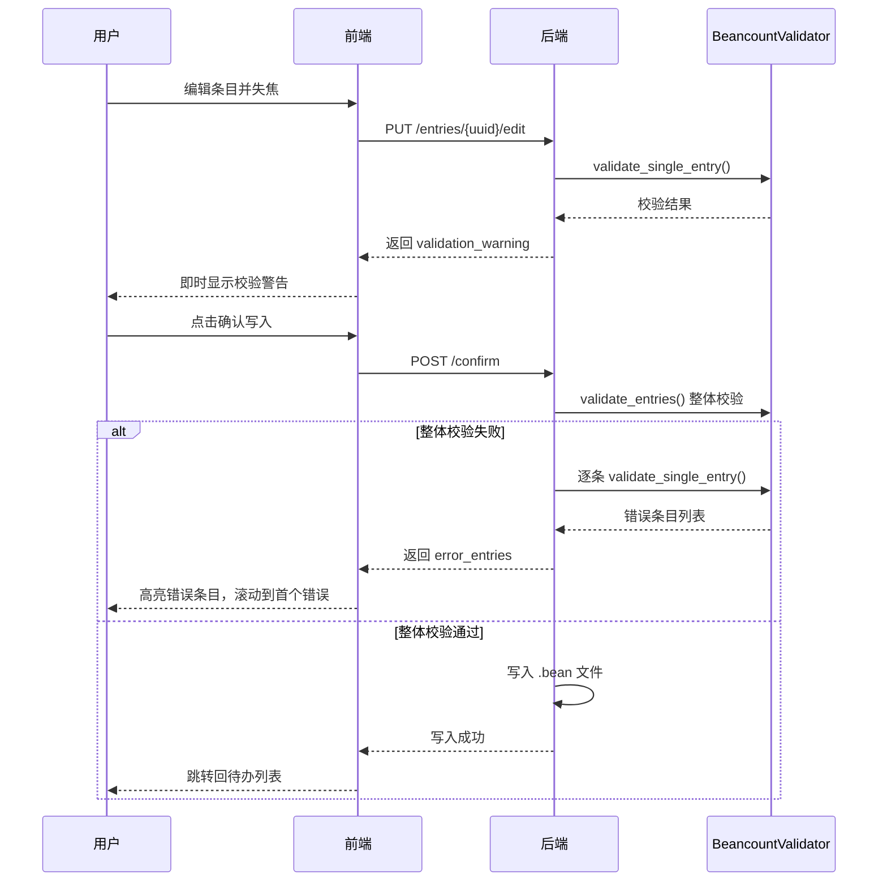

# 解析审核 Beancount 语法错误精确定位

## 问题分析

当前"确认写入"流程将所有条目合并为一个字符串，调用 `BeancountValidator.validate_entries()` 做整体校验。校验失败时只返回一个笼统的错误信息（如 `"syntax error, unexpected STRING"`），用户无法知道是哪条条目出了问题。

核心代码在 `[views/views.py](Beancount-Trans-Backend/project/apps/translate/views/views.py)` 第 728-740 行：

```python
formatted_text = '\n\n'.join([entry['formatted'].rstrip() for entry in final_entries])
is_valid, error_message, _ = BeancountValidator.validate_entries(formatted_text)
if not is_valid:
    return Response({'error': f'Beancount 语法错误: {error_message}'}, status=400)
```

值得注意的是，`BeancountValidator` 已有 `validate_multiple_entries()` 方法能逐条校验并定位错误条目索引，但当前未被使用。

## 方案设计

### 1. 后端：确认写入接口返回逐条错误信息

**文件**: `[views/views.py](Beancount-Trans-Backend/project/apps/translate/views/views.py)` `ParseReviewConfirmView.post()`

改动思路：

- 整体校验失败后，对每条条目逐个调用 `validate_single_entry()` 定位错误
- 返回结构化的错误响应，包含 `error_entries` 数组（每项含 `uuid`、`index`、`error_message`、`edited_formatted` 片段）
- 保持向后兼容：`error` 字段仍保留总结信息

新的错误响应格式：

```json
{
  "error": "Beancount 语法错误: 共 2 条格式有误",
  "error_entries": [
    {
      "uuid": "abc-123",
      "index": 3,
      "error_message": "syntax error, unexpected STRING"
    },
    {
      "uuid": "def-456",
      "index": 7,
      "error_message": "Invalid account name: ..."
    }
  ]
}
```

### 2. 后端：编辑保存时增加单条校验（即时反馈）

**文件**: `[views/views.py](Beancount-Trans-Backend/project/apps/translate/views/views.py)` `ParseReviewEditView.put()`

改动思路：

- 在保存 `edited_formatted` 到缓存后，对该单条内容调用 `validate_single_entry()` 做校验
- 校验结果作为 `warning` 字段返回（不阻断保存），提供即时反馈

新的编辑响应格式（校验失败时）：

```json
{
  "uuid": "abc-123",
  "edited_formatted": "...",
  "validation_warning": "syntax error, unexpected STRING"
}
```

### 3. 后端：自动确认任务也使用逐条校验

**文件**: `[tasks.py](Beancount-Trans-Backend/project/apps/translate/tasks.py)` `auto_confirm_expired_parse_reviews`

改动思路：

- 与确认写入接口保持一致，日志中记录具体哪些条目有语法错误

### 4. 前端：确认写入失败时高亮错误条目

**文件**: `[ParseReviewForm.vue](Beancount-Trans-Frontend/src/views/parse-review/ParseReviewForm.vue)`

改动思路：

- 解析 `confirmWrite` 接口返回的 `error_entries`
- 维护一个 `errorEntries` 的 Map（uuid -> error_message）
- 在表格中为有错误的条目 textarea 添加红色边框样式
- 在条目下方显示错误提示信息
- 自动滚动到第一条错误条目
- 用户重新编辑该条目后，清除其错误状态

### 5. 前端：编辑保存时显示即时校验警告

**文件**: `[ParseReviewForm.vue](Beancount-Trans-Frontend/src/views/parse-review/ParseReviewForm.vue)`

改动思路：

- 在 `handleEntryEdit` 的响应中检查 `validation_warning` 字段
- 如有警告，将该条目标记为有警告状态（黄色/橙色边框）
- 在条目下方显示校验警告信息

### 6. 前端：类型定义更新

**文件**: `[types/parse-review.ts](Beancount-Trans-Frontend/src/types/parse-review.ts)`

改动思路：

- 为确认写入错误响应添加类型定义
- 为编辑响应中的 `validation_warning` 添加字段

## 数据流




