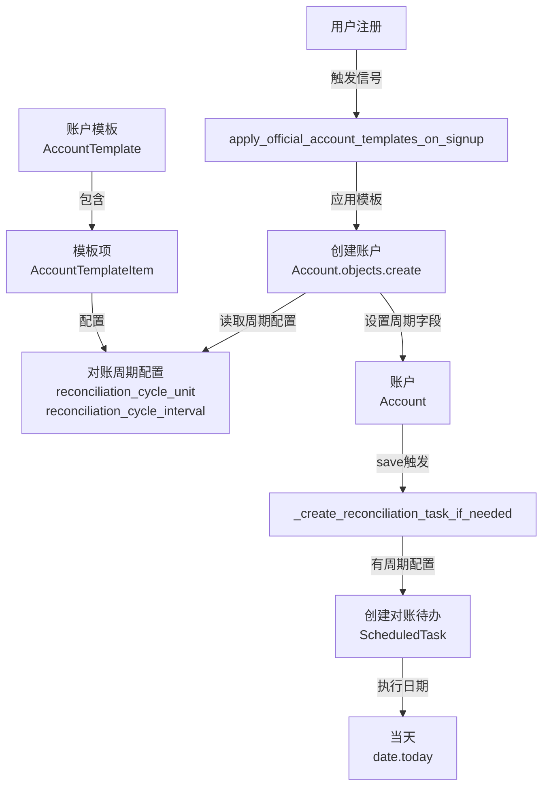

# 账户模板对账周期功能实现计划

## 需求概述

在账户模板中直接为指定账户设置对账周期，新用户创建时根据账户模板创建账户后，如果某些账户有设置对账周期，自动为该用户生成该账户的对账待办。

## 技术方案

### 数据流设计




### 核心改动点

1. **数据模型扩展**：`AccountTemplateItem` 添加对账周期字段
2. **序列化器扩展**：`AccountTemplateItemSerializer` 支持周期字段
3. **模板应用逻辑**：三个位置创建账户时设置周期字段
4. **前端界面**：模板管理页面支持设置周期

## 实施步骤

### 阶段一：后端数据模型扩展

#### 1. 扩展 AccountTemplateItem 模型

**文件**：`Beancount-Trans-Backend/project/apps/account/models.py`

- 在 `AccountTemplateItem` 类中添加两个字段：
- `reconciliation_cycle_unit`：CharField，choices=CycleUnit.choices，null=True, blank=True
- `reconciliation_cycle_interval`：PositiveIntegerField，null=True, blank=True
- 添加验证逻辑：两个字段必须同时设置或同时为空（参考 Account 模型的 clean 方法）
- 创建数据库迁移文件

**设计说明**：

- 字段可为空，允许模板项选择性配置对账周期
- 复用 `CycleUnit` 枚举，保持与 Account 模型一致
- 字段命名与 Account 模型完全一致，便于代码复用

#### 2. 扩展 AccountTemplateItemSerializer

**文件**：`Beancount-Trans-Backend/project/apps/account/serializers.py`

- 在 `AccountTemplateItemSerializer` 的 `fields` 中添加：
- `reconciliation_cycle_unit`
- `reconciliation_cycle_interval`
- 确保字段在 `read_only_fields` 中正确配置

### 阶段二：模板应用逻辑改造

需要在三个位置修改账户创建逻辑，添加对账周期字段的设置。

#### 3. 修改用户注册信号处理

**文件**：`Beancount-Trans-Backend/project/apps/account/signals.py`

- 在 `apply_official_account_templates()` 函数中，修改 `Account.objects.create()` 调用：
- 添加 `reconciliation_cycle_unit=item.reconciliation_cycle_unit`
- 添加 `reconciliation_cycle_interval=item.reconciliation_cycle_interval`
- 位置：第34-38行的账户创建代码

**关键代码位置**：

```python
Account.objects.create(
    owner=user,
    account=item.account_path,
    enable=item.enable,
    reconciliation_cycle_unit=item.reconciliation_cycle_unit,  # 新增
    reconciliation_cycle_interval=item.reconciliation_cycle_interval  # 新增
)
```


#### 4. 修改模板应用视图

**文件**：`Beancount-Trans-Backend/project/apps/account/views.py`

- 在 `AccountTemplateViewSet._apply_account_template()` 方法中，修改两处 `Account.objects.create()` 调用：
- 第393-397行（overwrite模式）
- 第413-417行（merge模式）
- 添加周期字段的设置

#### 5. 修改管理命令

**文件**：`Beancount-Trans-Backend/project/apps/account/management/commands/apply_templates_to_users.py`

- 在 `_create_accounts_from_template()` 方法中，修改 `Account.objects.create()` 调用（第266-271行）
- 添加周期字段的设置

**设计说明**：

- 所有三个位置都需要修改，确保无论通过哪种方式应用模板，都能正确设置对账周期
- 利用现有的 `Account._create_reconciliation_task_if_needed()` 方法自动创建待办，无需额外逻辑

### 阶段三：前端模板管理界面

#### 6. 扩展模板项编辑表单

**文件**：`Beancount-Trans-Frontend/src/components/config/AccountTemplateManagement.vue`（或相关组件）

- 在模板项编辑表单中添加对账周期配置：
- 周期单位下拉框（天/周/月/年）
- 周期间隔输入框（正整数）
- 表单验证：两个字段必须同时填写或同时为空
- 显示格式：当有周期配置时，显示为"每 [间隔] [单位]"

#### 7. 模板详情展示

- 在模板详情页面显示哪些账户配置了对账周期
- 列表展示时显示周期信息（可选）

### 阶段四：测试验证

#### 8. 功能测试

- 创建带对账周期的模板项
- 新用户注册验证账户周期设置
- 验证对账待办自动创建（执行日期为当天）
- 验证待办列表正确显示
- 测试模板应用的不同模式（overwrite/merge）

#### 9. 边界情况测试

- 模板项无周期配置（账户不设置周期，不创建待办）
- 模板应用时账户已存在（merge模式跳过，overwrite模式覆盖）
- 周期配置验证（两个字段必须同时设置）

## 技术要点

1. **复用现有逻辑**：利用 `Account._create_reconciliation_task_if_needed()` 自动创建待办，无需额外代码
2. **数据一致性**：字段可为空，现有模板不受影响，向后兼容
3. **验证逻辑**：AccountTemplateItem 的 clean 方法需要验证周期字段的一致性
4. **事务保证**：模板应用过程在事务中执行，确保数据一致性

## 依赖关系

- 依赖现有的对账周期系统（Account 模型的周期字段和待办生成逻辑）
- 依赖现有的账户模板系统（AccountTemplate 和 AccountTemplateItem）
- 无需新增外部依赖

## 风险评估

- **低风险**：主要是数据模型扩展和字段传递，逻辑简单