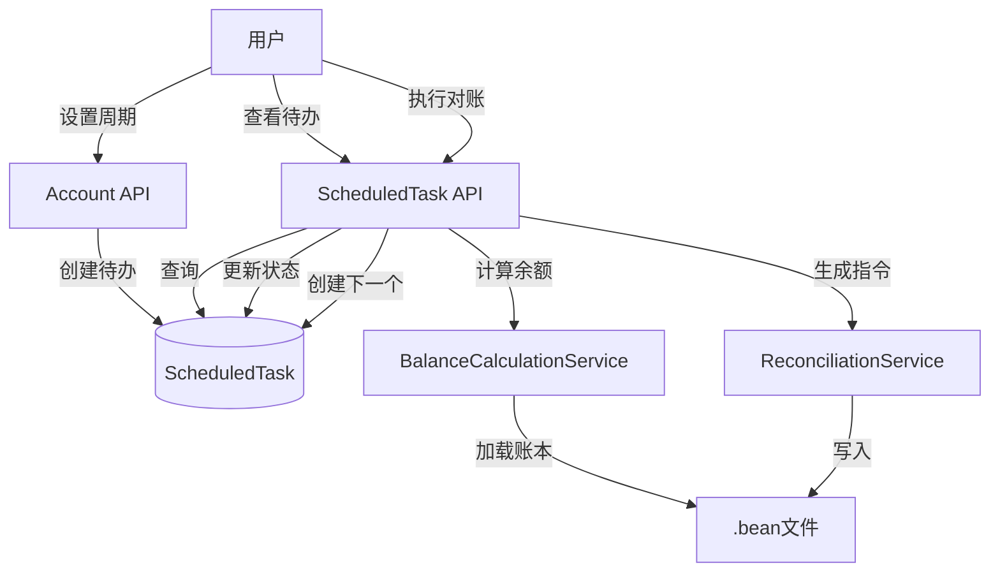

# 资产管理（对账功能）剩余需求实现计划

## 当前状态

✅ **已实现**：

- `BalanceCalculationService` - 余额计算服务（完整实现，支持多币种）

❌ **待实现**：

- 后端：模型、服务、API
- 前端：页面、组件、类型定义
- 文档：用户指南

## 实施计划

### 阶段一：后端核心模型和服务

#### 1. 周期单位枚举和日历计算服务

- **文件**：`Beancount-Trans-Backend/project/apps/reconciliation/models.py`
- 定义 `CycleUnit` 枚举（TextChoices：days, weeks, months, years）
- **文件**：`Beancount-Trans-Backend/project/apps/reconciliation/services/cycle_calculator.py`
- 实现 `CycleCalculator` 类，使用 `python-dateutil.relativedelta` 计算下一个执行日期
- 方法：`get_next_date(unit, interval, from_date)` 和 `is_valid_unit(unit)`
- 注意：基于 `scheduled_date` 而非 `completed_date` 计算，保持周期性

#### 2. ScheduledTask 模型

- **文件**：`Beancount-Trans-Backend/project/apps/reconciliation/models.py`
- 创建 `ScheduledTask` 模型（继承 `BaseModel`）
- 字段：`task_type`（reconciliation/ai_feedback）、`content_type`/`object_id`（GenericForeignKey）、`scheduled_date`、`completed_date`、`status`（pending/completed/cancelled）
- 索引：`['task_type', 'status', 'scheduled_date']` 和 `['content_type', 'object_id']`
- 创建数据库迁移

#### 3. Account 模型扩展

- **文件**：`Beancount-Trans-Backend/project/apps/account/models.py`
- 添加字段：`reconciliation_cycle_unit`（CharField，choices=CycleUnit）、`reconciliation_cycle_interval`（PositiveIntegerField，null=True）
- 创建数据库迁移

#### 4. 对账服务

- **文件**：`Beancount-Trans-Backend/project/apps/reconciliation/services/reconciliation_service.py`
- 实现 `ReconciliationService.execute_reconciliation()` 方法
- 处理三种差额场景：无差额（仅 balance）、小差额（balance + pad）、大差额（balance + transactions + pad）
- 生成指令并写入 .bean 文件（使用 `BeanFileManager`）
- 更新待办状态并创建下一个待办（基于 `scheduled_date`）
- **文件**：`Beancount-Trans-Backend/project/apps/reconciliation/services/__init__.py`
- 导出所有服务类

#### 5. 数据验证器

- **文件**：`Beancount-Trans-Backend/project/apps/reconciliation/validators.py`
- 实现 `ReconciliationValidator.validate_reconciliation_data()` 方法
- 验证 transaction_items 的账户、金额总和、自动计算逻辑

### 阶段二：后端 API

#### 6. ScheduledTask 序列化器

- **文件**：`Beancount-Trans-Backend/project/apps/reconciliation/serializers.py`
- `ScheduledTaskSerializer`：基础序列化器
- `ScheduledTaskListSerializer`：列表序列化器（包含账户信息）
- `ScheduledTaskUpdateSerializer`：更新序列化器（仅 scheduled_date）
- `ReconciliationStartSerializer`：开始对账响应序列化器
- `ReconciliationExecuteSerializer`：执行对账请求序列化器

#### 7. ScheduledTask 视图集

- **文件**：`Beancount-Trans-Backend/project/apps/reconciliation/views.py`
- 创建 `ScheduledTaskViewSet`（ModelViewSet）
- 自定义 action：
    - `start`：计算并返回预期余额
    - `execute`：执行对账，处理差额，生成指令，更新状态，创建下一个待办
    - `cancel`：取消待办（status='cancelled'）
- 过滤：`scheduled_date <= today()` 且 `status=pending` 的待办
- 权限：使用 `IsOwnerOrAdminReadWriteOnly`

#### 8. Account API 扩展

- **文件**：`Beancount-Trans-Backend/project/apps/account/views.py`
- 在 `AccountViewSet.perform_update()` 中处理周期配置变更：
    - 首次设置周期时创建待办（`scheduled_date=今日`）
    - 删除周期时，将相关待办的 `status` 更新为 `cancelled`
    - 修改周期时，相关待办不自动更新（保持原有 scheduled_date）
- **文件**：`Beancount-Trans-Backend/project/apps/account/serializers.py`
- 在 `AccountSerializer` 中添加 `reconciliation_cycle_unit` 和 `reconciliation_cycle_interval` 字段

#### 9. URL 配置

- **文件**：`Beancount-Trans-Backend/project/apps/reconciliation/urls.py`（新建）
- 创建 router 并注册 `ScheduledTaskViewSet`
- **文件**：`Beancount-Trans-Backend/project/urls.py`
- 添加：`path('api/reconciliation/', include('project.apps.reconciliation.urls'))`

#### 10. Admin 配置

- **文件**：`Beancount-Trans-Backend/project/apps/reconciliation/admin.py`
- 注册 `ScheduledTask` 模型到 Django Admin

### 阶段三：前端类型定义和 API

#### 11. TypeScript 类型定义

- **文件**：`Beancount-Trans-Frontend/src/types/reconciliation.ts`（新建）
- `CycleUnit` 枚举
- `ScheduledTask` 接口
- `TransactionItem` 接口
- `ReconciliationFormData` 接口
- `ReconciliationStartResponse` 接口
- `ReconciliationExecuteRequest` 接口

#### 12. API 调用函数

- **文件**：`Beancount-Trans-Frontend/src/api/reconciliation.ts`（新建）
- `getTasks()`：获取待办列表
- `getTask(id)`：获取待办详情
- `updateTask(id, data)`：更新待办日期
- `cancelTask(id)`：取消待办
- `startReconciliation(id)`：开始对账（获取预期余额）
- `executeReconciliation(id, data)`：执行对账

### 阶段四：前端页面和组件

#### 13. 待办列表页面

- **文件**：`Beancount-Trans-Frontend/src/views/reconciliation/ReconciliationList.vue`（新建）
- 显示 `scheduled_date <= today()` 且 `status=pending` 的待办
- 列表项：账户名称、预期执行日期、操作按钮（开始对账、修改日期、取消）
- 暂不区分今日/逾期待办（统一展示）

#### 14. 对账表单组件

- **文件**：`Beancount-Trans-Frontend/src/views/reconciliation/ReconciliationForm.vue`（新建）
- 显示预期余额（只读）
- 用户输入实际余额
- 自动计算差额
- 动态表单（有差额时）：
    - 账户选择器
    - 金额输入框（可选）
    - "自动计算" 复选框（仅一个条目可标记）
    - 添加/删除条目按钮
    - 实时验证和错误提示
- 提交表单

#### 15. 账户设置页面扩展

- **文件**：`Beancount-Trans-Frontend/src/components/config/AccountManagement.vue`
- 在账户编辑表单中添加对账周期配置：
    - 周期单位下拉框（天/周/月/年）
    - 间隔数量输入框（正整数）
    - 显示格式："每 [数量] [单位]"
- 保存时调用 Account API 更新周期配置

#### 16. 路由配置

- **文件**：`Beancount-Trans-Frontend/src/routers.ts`
- 添加路由：`/reconciliation`（待办列表）、`/reconciliation/:id`（对账表单）

### 阶段五：测试和文档

#### 17. 后端单元测试

- **文件**：`Beancount-Trans-Backend/project/apps/reconciliation/tests.py`
- `CycleCalculator` 测试（各种周期单位、边界情况）
- `BalanceCalculationService` 测试（已有，补充）
- `ReconciliationService` 测试（三种差额场景）
- `ScheduledTask` API 测试

#### 18. 用户文档

- **文件**：`Beancount-Trans-Docs/docs/02-用户指南/08-对账.md`（新建）
- Balance/Pad 概念说明
- 对账周期设置指南
- 对账执行流程
- 差额处理说明

## 技术要点

1. **周期计算**：使用 `python-dateutil.relativedelta`，基于 `scheduled_date` 而非 `completed_date`，保持周期性
2. **差额处理**：三种场景统一使用动态表单，后端根据是否有自动计算条目生成不同指令
3. **解耦设计**：Account、ScheduledTask、CycleCalculator 三方解耦，周期配置变更不影响已有待办
4. **数据验证**：前后端双重验证，确保数据一致性

## 依赖检查

- ✅ `python-dateutil` 已在 `Pipfile` 中
- ✅ `beancount` 已在 `requirements.txt` 中
- ✅ `BeanFileManager` 已存在（`project/utils/file.py`）

## 数据流

