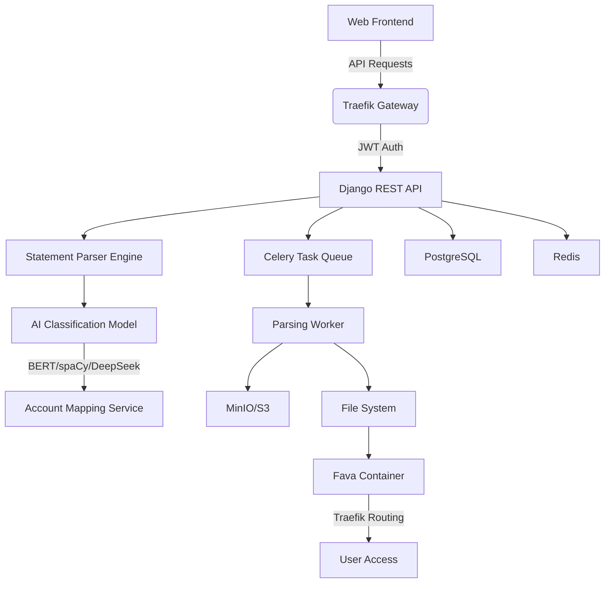
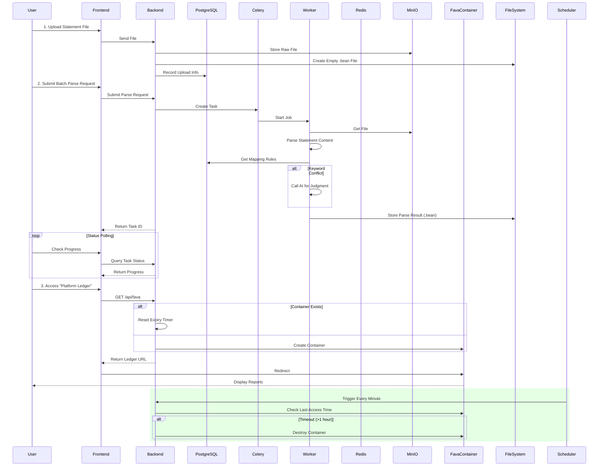

# Beancount-Trans

[](README.md)
[](README_zh.md)

[](LICENSE)
[](https://www.python.org/)
[](https://www.docker.com/)

## 🌟 Project Overview

Beancount-Trans is a (self-hosted) intelligent bill conversion platform that helps users easily convert daily transaction statements (such as Alipay, WeChat Pay, bank statements, etc.) into a professional bookkeeping format (Beancount) and provides comprehensive financial reporting services.

### 🌍 Vision

To enable ordinary users without accounting knowledge to easily use professional-grade double-entry bookkeeping tools, achieving transparent financial management.

### ✨ Core Value

* **Zero Learning Curve**: No accounting knowledge or technical background required.
* **One-Click Reports**: Get complete financial reports just by uploading your statements.
* **Smart Categorization**: AI-powered transaction category recognition.
* **Privacy First**: Complete user data isolation ensures privacy.

### 🚀 Core Features

* 🔐 **Self-Hosting Support**: Fully open-source, supports private deployment.
* 🧠 **AI-Powered Parsing**: Uses AI technologies like DeepSeek to automatically identify transaction categories.
* 🔒 **Containerized Isolation**: Each user has an independent financial environment.
* 📱 **Access Anywhere**: View your financial data anytime, anywhere.
* 📁 **Statement File Management**: Supports common statement formats like CSV, PDF, Excel.
* 📊 **Financial Reporting Services**: Automatically generates professional financial reports.
* ⚡ **Asynchronous Processing**: Optional batch processing after upload for fast report generation.

## 🛠️ Technical Architecture



### Cloud Platform Parsing Flow



## 🎥 Platform Demo


## 🚀 Quick Start

### 👤 Cloud Platform Users

Just 3 steps from statement upload to professional financial reports:

#### Step 1: Register & Login

1. Visit the [Beancount-Trans Platform](https://trans.dhr2333.cn/)
2. Create a new account or use a third-party login.

#### Step 2: Upload & Parse Statements

1. Click "Upload Statement" on the File Management page.
2. Select your Alipay, WeChat, or bank statement file.
3. Select the statements for batch parsing and conversion to the professional format.

Example Output (`beancount` format):

```beancount
2018-01-19 * "Ctrip" "Danqing Lily Business Hotel (Changzhou Jinghu High-speed Rail North Station Branch)"
    time: "14:41:51"
    uuid: "2018011921001004560568228384"
    status: "ALiPay - Transaction Successful"
    Expenses:Culture 128.00 CNY
    Liabilities:CreditCard:Web:AliPay -128.00 CNY
```

#### Step 3: Access Financial Reports

1. Click "Platform Ledger" in the navigation bar under "Ledger Management".
2. The system will automatically create your dedicated financial container.
3. View professional financial reports including:
    * 💰 Income Statement (Income vs. Expenses)
    * 🏦 Balance Sheet (Assets vs. Liabilities)
    * 📈 Spending Category Statistics
    * 📆 Monthly Financial Trends

### 🖥 Self-Hosted Deployment Guide

#### Project Initialization

```shell
git clone https://github.com/dhr2333/Beancount-Trans.git
cd Beancount-Trans
git submodule update --init  # Initialize all submodules
```

#### First Run

The first run will automatically create storage volumes named `postgres-data` and `redis-data`.

All container ports can be specified as needed.

Run the following command in the main Beancount-Trans directory:

```shell
docker compose up  # Add the -d flag to run in detached mode
```

Alternatively, build and then run:

```shell
# If using build configuration in compose file (example snippet shown)
$ docker compose build  # Build images
$ docker compose up    # Start containers
```


#### Access

Access the parser via <http://localhost:38001/trans> and copy the results into your local ledger.


## 📚 Documentation & Resources

* [Cloud Platform User Guide](/docs/parsing_spec.md)
* [Beancount Getting Started](https://www.dhr2333.cn/article/2022/9/10/51.html) (Chinese)
* [Deployment Guide](/docs/deployment.md)

## 🚀 Semantic Release

This repository adopts [semantic-release](https://semantic-release.gitbook.io/semantic-release/) for automated versioning and changelog generation.

1. Follow the [Conventional Commits](https://www.conventionalcommits.org/) convention when writing commit messages (e.g. `feat: ...`, `fix: ...`).
2. Merges into the `main` branch trigger the Jenkins pipeline located at the repository root. The pipeline runs `npx semantic-release`, bumping versions across sub-projects, generating `CHANGELOG.md`, and publishing a GitHub Release.
3. Each release automatically synchronizes the new version into:
   * `Beancount-Trans/package.json`
   * `Beancount-Trans-Frontend/package.json`
   * `Beancount-Trans-Docs/package.json`
   * `Beancount-Trans-Docs/docs/07-版本更新日志/v<version>.md` (auto-created when absent)
4. After the pipeline finishes, maintainers only need to edit the generated changelog entries and documentation templates as necessary.
* [API Documentation](https://trans.dhr2333.cn/api/redoc/)
* [Knowledge Base / Wiki](https://www.dhr2333.cn/category/beancountfu-shi-ji-zhang.html) (Chinese)

## 👥 Community & Support

* 🐛 [Report Issues](https://github.com/dhr2333/Beancount-Trans/issues)
* 💬 [Discussions](https://github.com/dhr2333/Beancount-Trans/discussions)
* 📧 [Support Email](mailto:dai_haorui@163.com)

## ❤️ Support Us

Donations will be used entirely to improve the parsing speed of the [website](https://trans.dhr2333.cn/).

WeChat Pay supports label parsing, add suffix `#TEST` in the notes if needed.
Alipay supports credit card and Huabei payments.

<div>


</div>
