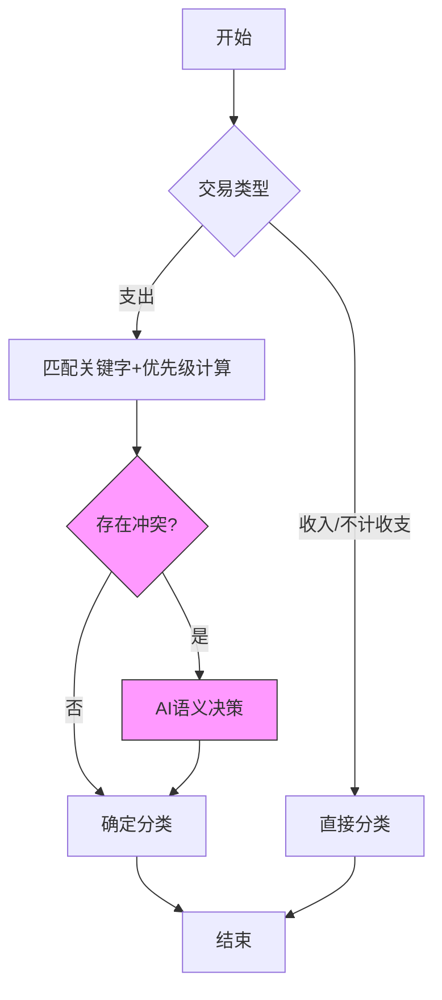

# Beancount-Trans

🌟Beancount-Trans - 基于语义分析和规则引擎的自动化 Beancount 账单生成工具

## 🚀 核心价值

经过长期对 Beancount 的使用和测试，我发现在日常记账中最烦恼的有以下几点：

1. 由于**记录数量太多**，若每个记录都以单独条目记录则需要耗费大量时间，若以天为条目进行记账，又会导致条目的**颗粒度太大**；
2. 我是以周为频率进行记账断言的，对于长期记账来说这个**频率未免太频繁**；
3. **支出账户没有形成系统的规划**，导致记录条目时总是要纠结选用哪个支出账户，且记录后也无法通过 FAVA 的试算表了解自己的各类支出情况；


[在线体验](https://trans.dhr2333.cn/) | [本地部署](#🐳%20快速开始（本地容器环境部署）) | [案例账本](https://fava.pythonanywhere.com/example-beancount-file/income_statement/)

## ⚡ 快速开始

**上传账单，系统会根据定义好的商户和账户自动格式化输出为 beancount 能识别的文本**。当前支持自动更新至 [Beancount-Trans-Assets](https://github.com/dhr2333/Beancount-Trans-Assets) 项目，仅支持本地部署用户启用。

1. 根据 [账单导出及查看方法](https://www.dhr2333.cn/article/2024/4/27/77.html) 从对应平台中获取账单
2. 在 [首页](https://trans.dhr2333.cn/trans) 上传 csv 或 pdf 文件完成解析（无登录用户默认使用 admin 的通用映射模板）
3. 复制解析后的文本至 *自己账本* 或 Beancount-Trans-Assets 项目（提供基础的目录结构）对应的年月目录中
4. 修改文本中的 Expense:Other 和 Assets:Other 的条目（没有对应的映射条目）
5. 在 Beancount-Trans-Assets 项目中使用 `fava main.bean` 运行程序，通过 http://127.0.0.1:5000 访问
6. 根据 fava 提示修改错误条目


## 使用说明

该项目默认读者有 beancount 的使用经验。在使用 Beancount-Trans 过程中，有以下几点需要注意

### 确定映射账户



#### 解析优先级

当多个商家名称相似时（如「华为」「华为终端」「华为软件」），系统需要知道哪个分类更精准。我们通过「分类层级深度」和「商家信息」两个维度智能判断优先级。

| 分类示例                    | 层级深度            | 加分项       | 总优先级 | 匹配结果       |
| ----------------------- | --------------- | --------- | ---- | ---------- |
| 华为 → Shopping           | 2 层 (2×100=200) | 无商家信息     | 200  | 🟡 基础匹配    |
| 华为软件 → Culture          | 2 层 (2×100=200) | 有商家信息 +50 | 250  | 🟢 优先匹配    |
| 华为终端 → Shopping:Digital | 3 层 (3×100=300) | 有商家信息 +50 | 350  | 🟢 最高优先级匹配 |

1. 层级越深越精准：每多一级分类（用冒号分隔），优先级自动 +100
2. 商家信息加分：填写商家详细信息（如「华为旗舰店」），优先级额外 +50
3. 当出现多个条目解析优先级相同时：payee 字段会保留原始商家

#### 🤖 AI 辅助决策

当出现多个条目解析优先级相同时：

```text
2024-01-01 08:00:00,保险,国泰**司,fin***@cathay-ins.com.cn,保险-买家版运费险-EGGKA木耳边一体绒打底衫女内搭秋冬2022新款半高领加绒针织上衣等,支出,7.88,中信银行信用卡(5718),交易成功,2023010522001199861407503809	,T1100P1790123557322669684	,,
候选关键字: ["保险", "运费", "打底衫", "上衣"]

• 保险 → Expenses:Finance:Insurance (优先级200)
• 打底衫 → Expenses:Shopping:Clothing (优先级200)
• 上衣 → Expenses:Shopping:Clothing (优先级200)

# AI决策过程：
1. spaCy计算相似度: 
   - "保险" → 0.72
   - "打底衫" → 0.64
   - "上衣" → 0.68
1. 选择最高值 → "保险"
```

#### 三餐判断

服务对三餐的判断有两种形式，一种是根据 Expense 中的支出映射来决定最终的条目，例如账单中含有 " 早餐 " 的备注会被匹配到 "Expenses:Food:Breakfast"。

还有一种是后端的硬编码，系统在根据支出映射解析完成后得到的条目为 "Expenses:Food" 时，会根据账单时间对条目进行调整，例如发生在 06:00 到 10:00 之间的 "Expenses:Food" 条目，系统会自动修改为 "Expenses:Food:BreakFast"。

时段配置：
- 🍳 早餐：06:00-10:00
- 🍱 午餐：10:00-14:00
- 🍲 晚餐：16:00-20:00

当支出映射与三餐时间冲突时，例如在 `2023-11-26 10:49:54,扫二维码付款,瑞安市暖爸副食品店,"收款方备注:二维码收款付款方留言:饮料",支出,¥3.00,零钱通,已转账,100004990123112600060327753584678844	,10000499012023112601373972597516	,"/"` 条目中

包含 " 饮料 " 和 " 食品 " 两个关键字，其中 " 饮料 " 的 Expense 为 "Expenses:Food:DrinkFruit"，" 食品 " 的 Expense 为 "Expenses:Food"。虽然根据三餐判断时间为早餐 "Expenses:Food:Breakfast" 与 "Expenses:Food:DrinkFruit" 优先级一致，但实际情况归类于早餐并不合适。

所以关键字与三餐的判断规则为：先判断关键字优先级，再判断三餐时间。

### 默认忽略

默认会对余额宝账户的收益进行忽略，请在下个月 balance 时以 "Income:Investment:Interest" 利息计入。

默认会对微信支付状态为 " 已全额退款 "、 " 对方已退还 " 或以 " 已退款 " 开头的条目进行忽略。

默认会对支付宝支付状态为 " 退款成功 "、" 交易关闭 "、" 解冻成功 "、" 信用服务使用成功 "、" 已关闭 "、" 还款失败 "、" 等待付款 " 、" 芝麻免押下单成功 " 的条目进行忽略。

选中 " 生成 balance 对账信息 " 时，默认忽略同一天非最晚的记录。

### 手动处理

最终解析结果为 "Expenses:Other"、"Income:Other"、"Assets:Other" 时，说明无法正确解析，请手动处理或增加映射后再次解析。

当某个银行含有多张储蓄卡时，解析结果可能错误需手动处理。

由于各账单的字段是以 *逗号* 作为分隔，所以无法解析商家名称包含 `,` 的条目。

### 自动写入 Beancount-Trans-Assets

当选中 " 自动写入 Beancount-Trans-Assets" 后，系统会在解析完成后检查同级目录下 Beancount-Trans-Assets 是否有对应本年的年度账本，例如 `2023`。如果存在，系统会将数据正常写入该账本；如果不存在，系统会自动创建年度账本，并将解析后的文本写入其中。

本地用户通过 " 本地账本 " 查看。

平台用户可通过该功能将错误条目输出至 " 案例账本 "，作者会根据 " 案例账本 " 中的报错修改账单解析代码以求保证解析功能正确。

## 🐳 快速开始（本地容器环境部署）

为了方便用户使用，作者提供本地 docker compose 的部署方式。**推荐以该方式部署，集成了 fava 展示、自动记录、OwnTracks 轨迹记录等多项自动化功能**。

若无 Docker 环境，可参考 [本地环境部署](#Beancount-Trans-Backend) 文档。

### 项目初始化

```shell
git clone https://github.com/dhr2333/Beancount-Trans.git
cd Beancount-Trans; git submodule update --init  # 初始化所有子模块
# git submodule foreach git switch main  # 所有子模块切换到main分支
# git submodule foreach git pull origin main  # 若有需要则将所有子模块拉取main分支代码
```

### 首次运行

首次运行会自动创建名为 `mysql-data` 和 `redis-data` 的存储卷。

所有容器端口可自行指定。

在 Benacount-Trans 主目录下运行

```shell
$ docker compose up  # 增加 -d 参数可实现后台运行
```

或 编译后运行

```shell
services:
  beancount-trans-frontend:
    # image: dhr2333/beancount-trans-frontend:latest
    build:
      context: ./Beancount-Trans-Frontend
      dockerfile: Dockerfile
      args:
        - "--no-cache"
$ docker compose build  # 编译
$ docker compose up
```


### 访问

通过 http://localhost:38001/trans 进行解析，同时可以通过 " 我的账本 " 直接访问完整账本信息。


### 📊 持久化存储

MySQL 默认使用初始化数据，并不做持久化存储。若需要持久化存储需要放开以下注释：

```yaml
beancount-trans-mysql:
  volumes:
    - mysql:/var/lib/mysql  # 若需要持久存储取消该注释和volumes中的注释
volumes:
  mysql:
    external: true  # 若已创建外部存储卷，则取消该注释(多次docker compose up可能会导致存储卷重复创建导致启动失败)
    name: mysql-data
  redis:
    external: true  # 若已创建外部存储卷，则取消该注释
    name: redis-data
```

# Beancount-Trans-Assets

[Beancount-Trans-Assets](https://github.com/dhr2333/Beancount-Trans-Assets) 项目提供 **Beancount 账本组织结构**，所有记账条目以月进行统计，以年进行存档。

账本结构说明可参考 [Beancount_05_项目管理](https://www.dhr2333.cn/article/2022/9/10/55.html)。

GitHub 私有项目创建成功后，可将代码上传至私有仓库

```shell
git clone https://github.com/dhr2333/Beancount-Trans-Assets.git
cd Beancount-Trans-Assets
# 修改后
git add .
git commit -m "提交记录"
git remote add origin [你的项目链接]
git branch -M main
git push -u origin main
```

# Beancount-Trans-Backend

Beancount-Trans 项目集中的后端项目，主要实现账单格式的转换功能及提供对外接口。

## 安装

```shell
$ cd Beancount-Trans-Backend
$ pipenv install  #  安装虚拟环境
$ pipenv shell  # 使用虚拟环境
$ apt-get install -y mysql libmysqlclient mysql-clients  # requirements.txt中的mysqlclient包依赖于mysql,所以需手动下载
$ pip install -r requirements.txt  # 安装所需依赖
```

## 配置

修改 `mydemo/setting.py` 修改数据库配置，如下所示：

```
DATABASES = {
    'default': {
        'ENGINE': 'django.db.backends.mysql',
        'NAME': os.environ.get('TRANS_MYSQL_DATABASE') or 'beancount-trans',
        'USER': os.environ.get('TRANS_MYSQL_USER') or 'root',
        'PASSWORD': os.environ.get('TRANS_MYSQL_PASSWORD') or 'root',
        'HOST': os.environ.get('TRANS_MYSQL_HOST') or '127.0.0.1',
        'PORT': os.environ.get('TRANS_MYSQL_PORT') or '3306',
        'TIME_ZONE': 'Asia/Shanghai',
    }
}
```

修改 `manage.py` 配置文件使用 *本地开发环境* `mydemo.settings`：

```python
def main():  
    os.environ.setdefault('DJANGO_SETTINGS_MODULE', 'mydemo.settings')  # 本地开发环境
    try:  
        from django.core.management import execute_from_command_line  
    except ImportError as exc:  
        raise ImportError(  
            "Couldn't import Django. Are you sure it's installed and "  
            "available on your PYTHONPATH environment variable? Did you "            "forget to activate a virtual environment?"        ) from exc  
    execute_from_command_line(sys.argv)  
  
  
if __name__ == '__main__':  
    main()
```

## 创建数据库

MySQL 数据库中执行:

```sql
CREATE DATABASE `beancount-trans`
```

然后终端下执行:

```shell
python manage.py makemigrations
python manage.py migrate
```

导入提供的 SQL 模板，并根据自己的实际账户进行调整：

```shell
mysql -h127.0.0.1 -uroot -proot  beancount-trans < fixtures/20240507-Develop.sql  # 当前模板含有强烈的个人风格，建议根据自己情况修改
```

## 开始运行

执行： `python manage.py runserver 0:8002`

浏览器打开 http://127.0.0.1:8002/translate/trans 就可以完成简单的账单转换。

# Beancount-Trans-Frontend

修改 `.env` 配置文件使用 *本地开发环境* ：


运行前端程序：

```shell
$ npm install 
$ npm run dev  # 启动程序
```

浏览器打开 http://localhost:5173/ ，需要 Beancount-Trans-Backend 及数据库服务正常运行才能实现解析功能。

# 贡献 & 捐赠

如果你希望对 Beancount-Trans-Backend 做出贡献，请阅读我们的 [贡献指南](https://github.com/dhr2333/Beancount-Trans-Backend?tab=readme-ov-file#%E8%B4%A1%E7%8C%AE%E6%8C%87%E5%8D%97)。

关于 Beancount-Trans 及子项目有任何项目及使用上的问题，建议提 issue。

捐赠收入将全部用于提高 [网站](https://trans.dhr2333.cn/) 解析速度。

## 微信 & 支付宝

微信支持标签解析，备注可添加后缀 `#TEST`

支付宝支持信用卡及花呗支付

<div>
  
  
</div>
