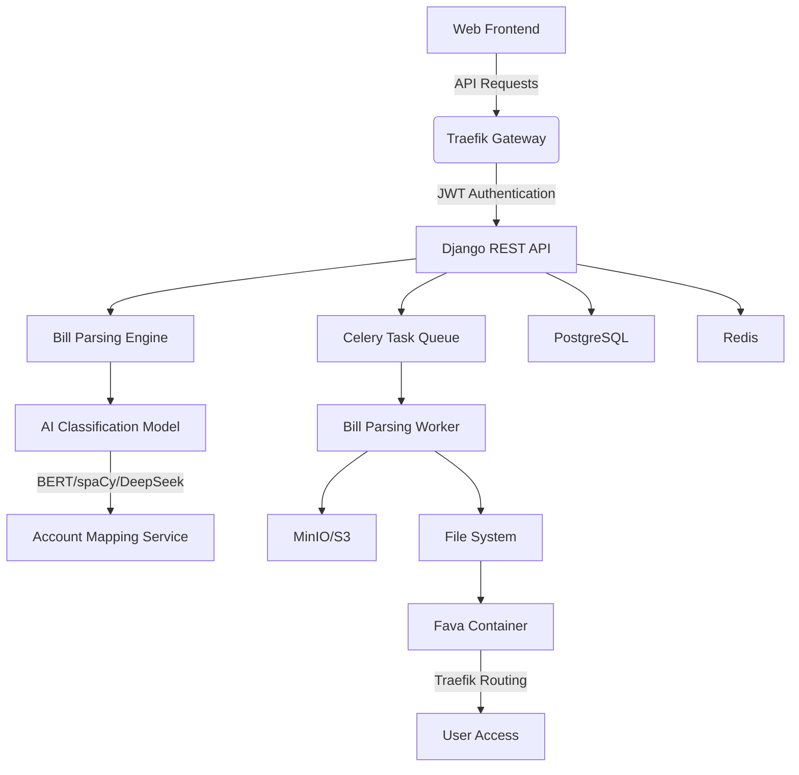

# Beancount-Trans

[](README.md)
[](README_zh.md)

[](LICENSE)
[](https://www.python.org/)
[](https://www.docker.com/)

## 🌟 Project Overview

Beancount-Trans is a (self-hosted) intelligent bill conversion platform that helps users easily convert daily bills (such as Alipay, WeChat Pay, bank statements, etc.) into professional accounting formats, and provides complete financial reporting services.

### 🌍 Vision

Enable ordinary users without accounting knowledge to easily use professional-level double-entry accounting tools for transparent financial management.

### ✨ Core Value

- **Zero Barrier to Use**: No accounting knowledge or technical background required
- **One-Click Reporting**: Get complete financial reports with just your bills
- **Smart Categorization**: AI-powered transaction category recognition
- **Privacy First**: Complete user data isolation to ensure privacy

### 🚀 Core Features

- 🔐 **Self-Hosting Support**: Fully open source, supports private deployment
- 🧠 **AI Intelligent Parsing**: Automatically identifies transaction categories using AI technologies like DeepSeek
- 🔒 **Containerized Isolation**: Each user has an independent financial environment
- 🔑 **Two-Factor Authentication (2FA)**: Enhanced account security
- 📱 **Access Anywhere**: View financial data anytime, anywhere
- 📁 **Bill File Management**: Supports common bill formats like CSV/PDF/Excel
- 📊 **Financial Reporting Services**: Automatically generates professional financial reports
- ⚡ **Asynchronous Processing**: Optional batch processing after bill upload for fast report generation

## 🛠️ Technical Architecture



### Cloud Platform Parsing Process


## 🎥 Platform Demo

The format conversion page does not retain any uploaded files or information; all optional functions are for parsing purposes.


## 🚀 Quick Start

### 👤 Cloud Platform Users

Just 3 steps from bill upload to financial report generation:

#### Step 1: Register and Login

1. Visit [Beancount-Trans Platform](https://trans.dhr2333.cn/)
2. Register as a new user or use third-party login

#### Step 2: Upload and Parse Bills

1. Click "Upload Bill" on the file management page
2. Select Alipay, WeChat, or bank statement files
3. Select Batch Parse Bill Records to Ledger

```beancount
2018-01-19 * "携程旅行网" "丹青百合商务酒店(常州京沪高铁北站店)" #Business
    time: "14:41:51"
    uuid: "2018011921001004560568228384"
    status: "ALiPay - 交易成功"
    Expenses:Culture 128.00 CNY
    Assets:Savings:Web:AliFund -128.00 CNY
```

#### Step 3: Access Financial Reports

1. Click "Platform Ledger" in the navigation bar under "Ledger Management"
2. The system will automatically create your exclusive financial container
3. View professional financial reports:
   - 💰 Income Statement (Income vs Expenses)
   - 🏦 Balance Sheet (Assets vs Liabilities)
   - 📈 Spending Category Statistics
   - 📆 Monthly Financial Trends

### 🖥 Self-Hosted Deployment Guide

#### Project Initialization

```shell
git clone https://github.com/dhr2333/Beancount-Trans.git
cd Beancount-Trans;
git submodule update --init --recursive  # Initialize all submodules
git submodule foreach git switch main  # Switch submodules to main branch
```

#### First Run

The first run will automatically create storage volumes named `postgres-data` and `redis-data`.

All container ports can be specified as needed.

Run in the Beancount-Trans main directory:

```shell
docker compose up  # Add -d parameter to run in background
```

#### Access

Visit <http://localhost:38001/trans> to upload files for parsing, then copy the parsing results into your local ledger.

#### 📊 Persistent Storage

PostgreSQL uses initialization data by default and does not use persistent storage. If persistent storage is needed, uncomment the following:

```yaml
beancount-trans-postgres:
  volumes:
    - postgres:/var/lib/postgresql/data  # Uncomment this and the comment in volumes if persistent storage is needed
volumes:
  postgres:
    external: true  # Uncomment if external storage volume has been created (multiple docker compose up may cause volume duplication and startup failure)
    name: postgres-data
  redis:
    external: true  # Uncomment if external storage volume has been created
    name: redis-data
```

## 📚 Documentation Resources

- [Cloud Platform User Manual](https://trans.dhr2333.cn/docs/quick-start/)
- [Beancount Getting Started](https://www.dhr2333.cn/article/2022/9/10/51.html)
- [Deployment Guide](https://trans.dhr2333.cn/docs/%E8%87%AA%E6%89%98%E7%AE%A1/deploy)
- [API Documentation](https://trans.dhr2333.cn/api/redoc/)
- [Knowledge Base/Wiki](https://www.dhr2333.cn/category/beancountfu-shi-ji-zhang.html)

## 👥 Community & Support

- 🐛 [Report Issues](https://github.com/dhr2333/Beancount-Trans/issues)
- 💬 [Discussion Forum](https://github.com/dhr2333/Beancount-Trans/discussions)
- 🐧 [QQ Group](https://qm.qq.com/q/W1hsFN6fGq)

- 📧 [Support Email](mailto:dai_haorui@163.com)

## ❤️ Support Us

All donation income will be used to improve the [platform's](https://trans.dhr2333.cn/) parsing speed

WeChat Pay supports label parsing, you can add suffix `#TEST` in remarks

Alipay supports credit card and Huabei payments

<div>


</div>
