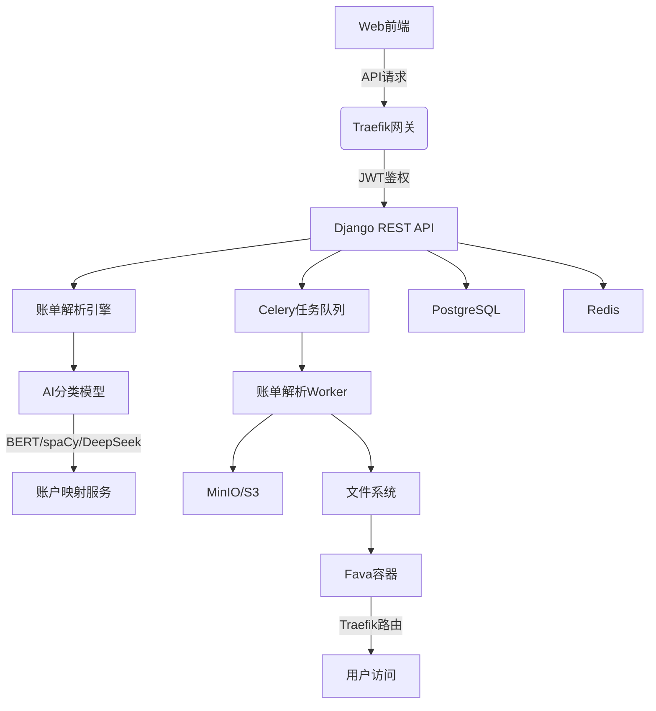
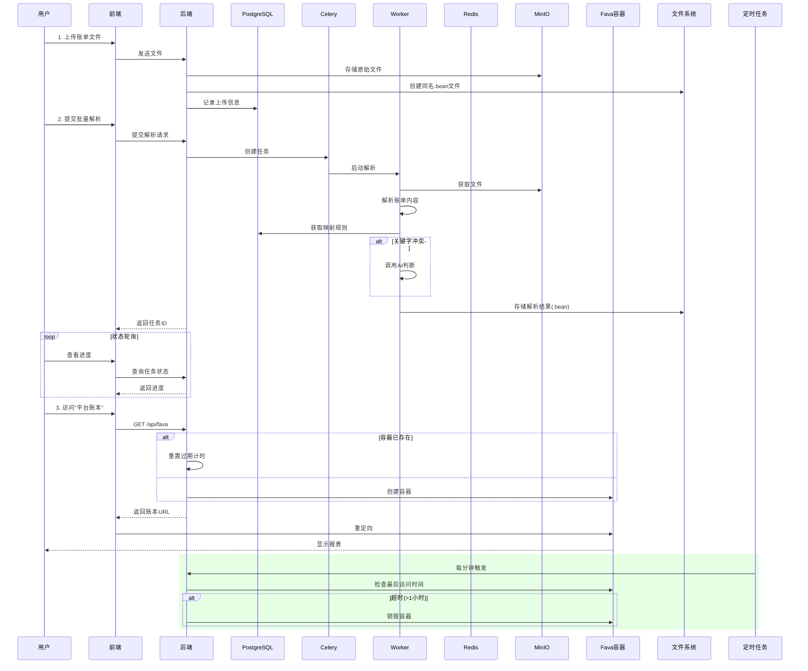

# Beancount-Trans

[](README.md)
[](README_zh.md)

[](LICENSE)
[](https://www.python.org/)
[](https://www.docker.com/)

## 🌟 项目概述

Beancount-Trans 是一款（自托管）智能账单转换平台，帮助用户轻松将日常账单（如支付宝、微信支付、银行账单等）转换为专业记账格式，并提供完整的财务报表服务。

### 🌍 愿景

让无会计知识的普通用户也能轻松使用专业级复式记账工具，实现财务透明化管理。

### ✨ 核心价值

- **零门槛使用**：无需会计知识或技术背景
- **一键式报表**：只需账单即得完整财务报表
- **智能分类**：AI 驱动的交易类别识别
- **隐私优先**：用户数据完全隔离，保障隐私

### 🚀 核心特性

- 🔐 **自托管支持**：完整开源，支持私有化部署
- 📋 **模板账本**：遵循复式记账最佳实践
- 📱 **随时随地访问**：随时查看财务数据
- 📊 **财务报表服务**：自动生成专业财务报表
- 🧠 **AI 智能解析**：使用 DeepSeek 等 AI 技术自动识别交易类别
- 🔒 **容器化隔离**：每个用户拥有独立的财务环境
- 🔑 **双因素认证 (2FA)**：增强账户安全
- 📁 **账单文件管理**：支持 CSV/PDF/Excel 等常见账单格式

## 🛠️ 技术架构



### 云平台解析流程



## 🎥 平台演示

格式转换页面不保留任何上传的文件及信息，所有可选功能均为解析功能服务。


## 🚀 快速开始

### 👤 云平台用户

只需 3 步，从账单上传到生成财务报表：

#### 步骤 1: 注册登录

1. 访问 [Beancount-Trans 平台](https://trans.dhr2333.cn/)
2. 注册新用户或使用第三方登录

#### 步骤 2: 上传账单并解析

1. 在文件管理页面点击 " 上传账单 "
2. 选择支付宝、微信或银行账单文件
3. 选中账单批量解析记录至账本

```beancount
2018-01-19 * "携程旅行网" "丹青百合商务酒店(常州京沪高铁北站店)" #Business
    time: "14:41:51"
    uuid: "2018011921001004560568228384"
    status: "ALiPay - 交易成功"
    Expenses:Culture 128.00 CNY
    Assets:Savings:Web:AliFund -128.00 CNY
```

#### 步骤 3: 访问财务报表

1. 在导航栏 " 账本管理 " 中点击 " 平台账本 "
2. 系统会自动创建您的专属财务容器
3. 查看专业财务报表：
   - 💰 损益表（收入 vs 支出）
   - 🏦 资产负债表（资产 vs 负债）
   - 📈 消费分类统计
   - 📆 月度财务趋势

### 🖥 自托管部署指南

#### 项目初始化

```shell
git clone https://github.com/dhr2333/Beancount-Trans.git
cd Beancount-Trans;
git submodule update --init --recursive  # 初始化所有子模块
git submodule foreach git switch main  # 子模块切换到 main 分支
```

#### 首次运行

首次运行会自动创建名为 `postgres-data` 和 `redis-data` 的存储卷。

所有容器端口可自行指定。

在 Benacount-Trans 主目录下运行

```shell
docker compose up  # 增加 -d 参数可实现后台运行
```

#### 访问

通过 <http://localhost:38001/trans> 进行上传文件解析，将解析结果复制进本地账本。

#### 📊 持久化存储

PostgreSQL 默认使用初始化数据，并不做持久化存储。若需要持久化存储需要放开以下注释：

```yaml
beancount-trans-postgres:
  volumes:
    - postgres:/var/lib/postgresql/data  # 若需要持久存储取消该注释和volumes中的注释
volumes:
  postgres:
    external: true  # 若已创建外部存储卷，则取消该注释(多次docker compose up可能会导致存储卷重复创建导致启动失败)
    name: postgres-data
  redis:
    external: true  # 若已创建外部存储卷，则取消该注释
    name: redis-data
```

## 📚 文档资源

- [云平台用户手册](https://trans.dhr2333.cn/docs/quick-start/)
- [Beancount 入门](https://www.dhr2333.cn/article/2022/9/10/51.html)
- [部署指南](https://trans.dhr2333.cn/docs/%E8%87%AA%E6%89%98%E7%AE%A1/deploy)
- [API 文档](https://trans.dhr2333.cn/api/redoc/)
- [知识库/维基](https://www.dhr2333.cn/category/beancountfu-shi-ji-zhang.html)

## 👥 社区与支持

- 🐛 [报告问题](https://github.com/dhr2333/Beancount-Trans/issues)
- 💬 [讨论区](https://github.com/dhr2333/Beancount-Trans/discussions)
- 📧 [支持邮箱](mailto:dhr2diary@gmail.com)
- 🐧 [QQ群](https://qm.qq.com/q/W1hsFN6fGq)


## ❤️ 支持我

捐赠收入将全部用于提高 [平台](https://trans.dhr2333.cn/) 解析速度

微信支付，备注可添加后缀 `#TEST` 为解析记录增加标签

支付宝支持信用卡及花呗支付

<div>


</div>
